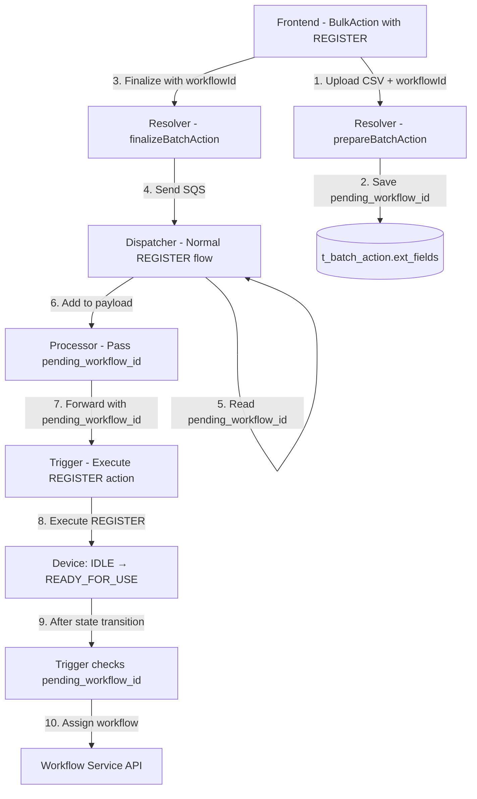

# Flow: Batch Upload + Assign Workflow on Portal

## Tổng quan

Flow này mô tả chi tiết quá trình bulk assign workflow từ portal, bao gồm:
- **Direct Assignment**: Device ở state R4U/ACTIVE/LOCKED → assign workflow ngay lập tức
- **Pending Assignment**: Device ở state IDLE + REGISTER action → save pending_workflow_id và assign sau khi device chuyển sang R4U

## Sơ đồ Tổng thể

### Flow A: Direct Assignment (Device ở R4U/ACTIVE/LOCKED)
```mermaid
graph TB
    FE[Frontend - BulkAction/index.tsx]
    PREP[Resolver - prepareBatchAction]
    FINAL[Resolver - finalizeBatchAction]
    DISP[Dispatcher - batch_action_dispatcher]
    PROC[Processor - batch_action_processor]
    TRIG[Trigger - action_trigger]
    WF[Workflow Service API]
    
    FE -->|1. Upload CSV + workflowId| PREP
    PREP -->|2. Save to t_batch_action| S3[(S3 Storage)]
    FE -->|3. Finalize with workflowId| FINAL
    FINAL -->|4. Send SQS| DISP
    DISP -->|5. Validate state [2,4,5]| DISP
    DISP -->|6. action_id = assign_solo_workflow| PROC
    PROC -->|7. Forward to trigger| TRIG
    TRIG -->|8. Call workflow API| WF
```

### Flow B: Pending Assignment (Device ở IDLE + REGISTER)


---

## Phase 1: Frontend → Resolver (Prepare)

### Frontend Component
**File**: [BulkAction/index.tsx](file:///home/thang/Documents/rsu/alps-ttp3-frontend/src/components/BulkAction/index.tsx)

#### User Actions
1. User chọn Bulk Action type = `WORKFLOW_ACTION`
2. Chọn service type (Prepaid/Postpaid/SIM Control)
3. Chọn workflow từ dropdown
4. Upload CSV file với device UIDs

#### Key Functions

**formatPrepareAction()** - Line 558:
```typescript
const formatPrepareAction = () => {
  if (bulkActionType === BulkActionType.WORKFLOW_ACTION) {
    const service_type_id = 
      workflowAction === WORKFLOW_ACTION.ASSIGN_WORKFLOW
        ? selectedWorkflow.service_type_id
        : parseInt(values.service);

    return {
      service_type_id,
      states: [],
    };
  }
}
```

**handleSubmit()** - Line 730:
```typescript
const prepareResult = await prepareAction({
  variables: {
    rowCount,
    deviceType,
    config: data,
    ...(bulkActionType === BulkActionType.WORKFLOW_ACTION && {
      serviceTypeId: selectedWorkflow.service_type_id,
    }),
  },
});
```

#### Mutation Request
```graphql
mutation prepareBatchAction(
  $rowCount: Int!
  $deviceType: DeviceTypeEnum!
  $config: AWSJSON!
  $serviceTypeId: Int
) {
  prepareBatchAction(
    rowCount: $rowCount
    deviceType: $deviceType
    config: $config
    serviceTypeId: $serviceTypeId
  ) {
    batchActionId
    fileUpload {
      url
      fields
    }
  }
}
```

---

## Phase 2: Resolver - prepareBatchAction

### Backend Function
**File**: [action_resolver/src/main.py](file:///home/thang/Documents/rsu/alps-ttp3-backend/modules/action_resolver/src/main.py#L706)

#### Logic Flow
```python
def prepare_batch_action(**kwargs):
    service_type_id = kwargs.get("service_type_id")
    config = kwargs.get('config')
    row_count = kwargs.get('row_count')
    
    ext_fields = {
        **config,
        "total_devices": row_count,
        "device_type": device_type,
    }
    
    if service_type_id is not None:
        ext_fields["service_type_id"] = service_type_id
    
    file_upload = s3_upload.file_upload(
        S3_BATCH_ACTION_STORAGE_BUCKET, 
        object_name
    )
    
    batch_action = conn.insert_batch_action(
        schema_name,
        tenant_id=tenant_id,
        created_by=user.id,
        upload_channel="PORTAL",
        ext_fields=json.dumps(ext_fields),
        file_url=file_upload['fields']['key']
    )
    
    return {
        "batchActionId": batch_action.id,
        "fileUpload": file_upload
    }
```

#### Database Record
Table: `t_batch_action`
```json
{
  "id": 123,
  "tenant_id": "tenant-uuid",
  "created_by": 456,
  "upload_channel": "PORTAL",
  "file_url": "batch-actions/tenant-xxx/uuid.csv",
  "ext_fields": {
    "service_type_id": 1,
    "states": [],
    "total_devices": 100,
    "device_type": 1
  }
}
```

---

## Phase 3: Frontend → Resolver (Finalize)

### Frontend Upload & Finalize
**File**: [BulkAction/index.tsx](file:///home/thang/Documents/rsu/alps-ttp3-frontend/src/components/BulkAction/index.tsx#L755)

```typescript
await uploadFileWithPresignS3(
  res?.prepareBatchAction.fileUpload, 
  currentFile
);

await finalizeAction({
  batchActionId: res.prepareBatchAction.batchActionId,
  batchUploadType: BatchUploadTypes.WORKFLOW_ACTION,
  workflowId: selectedWorkflow._id,
  serviceTypeId: selectedWorkflow.service_type_id,
});
```

### Backend Function
**File**: [action_resolver/src/main.py](file:///home/thang/Documents/rsu/alps-ttp3-backend/modules/action_resolver/src/main.py#L803)

```python
def finalize_batch_action(**kwargs):
    batch_action_id = kwargs.get("batch_action_id")
    batch_upload_type = kwargs.get("batch_upload_type")
    workflow_id = kwargs.get("workflow_id")
    
    batch_action = conn.get_batch_action(
        schema_name, 
        batch_action_id=batch_action_id
    )
    
    ext_fields = batch_action.ext_fields
    
    if workflow_id and workflow_id != "exit":
        ext_fields["pending_workflow_id"] = workflow_id
    
    modified_ext_fields = {
        **ext_fields, 
        'dispatched': True,
        "action_type": "Workflow Action"
    }
    
    conn.update_batch_action(
        schema_name, 
        batch_action_id, 
        json.dumps(modified_ext_fields)
    )
    
    payload = {
        "user_id": user.id,
        "username": username,
        "tenant_id": tenant_id,
        "batch_action_id": batch_action_id,
        "batch_upload_type": "WORKFLOW_ACTION",
        "workflow_id": workflow_id,
        "service_type_id": ext_fields.get("service_type_id")
    }
    
    send_message(payload, {}, BATCH_ACTION_DISPATCHER_SQS)
```

#### SQS Message to Dispatcher
```json
{
  "user_id": 123,
  "username": "admin@example.com",
  "tenant_id": "tenant-uuid",
  "batch_action_id": 456,
  "batch_upload_type": "WORKFLOW_ACTION",
  "workflow_id": "68a5ae7a4cb9e87b88b7d344",
  "service_type_id": 1
}
```

---

## Phase 4: Dispatcher - Validate & Process

### Backend Function
**File**: [batch_action_dispatcher/src/main.py](file:///home/thang/Documents/rsu/alps-ttp3-backend/modules/batch_action_dispatcher/src/main.py#L236)

### Flow A: WORKFLOW_ACTION (Direct Assignment)

Dispatcher có 2 luồng xử lý khác nhau:

#### 1. Direct Workflow Assignment (batch_upload_type = WORKFLOW_ACTION)
```python
def batch_action_upload(**kwargs):
    workflow_id = kwargs.get("workflow_id")
    batch_upload_type = kwargs.get("batch_upload_type")
    
    # FLOW A: Chỉ cho devices đã ở state R4U/ACTIVE/LOCKED
    if workflow_id and batch_upload_type == "WORKFLOW_ACTION":
        is_exit_workflow = workflow_id == "exit"
        action_id = "exit_solo_workflow" if is_exit_workflow \
                    else "assign_solo_workflow"
        
        allowed_states = [
            StateId.READY_FOR_USE,  # 2
            StateId.ACTIVE,          # 4
            StateId.LOCKED           # 5
        ]
        
        for device in devices:
            # Validation: Device MUST be in allowed states
            if device.state_id not in allowed_states:
                insert_error(Error.WRONG_STATE_DEVICE)
                continue
            
            # Build payload with special action_id
            payload = {
                "device_uid": device_uid,
                "action_id": action_id,  # "assign_solo_workflow"
                "solo_workflow": {"workflow_id": workflow_id},
                "batch_action_device_id": batch_action_device.id,
            }
            
            send_message(payload, {}, BATCH_ACTION_PROCESSOR_SQS)
        return
```

### Flow B: REGISTER with Pending Workflow

#### 2. Normal REGISTER Flow with pending_workflow_id
```python
def batch_action_upload(**kwargs):
    # FLOW B: Normal REGISTER flow (for IDLE devices)
    # Read pending_workflow_id from batch_action.ext_fields
    batch_action_ext_fields = batch_action.ext_fields or {}
    pending_workflow_id = batch_action_ext_fields.get("pending_workflow_id")
    pending_workflow_service_type_id = batch_action_ext_fields.get(
        "pending_workflow_service_type_id"
    )
    
    for device in devices:
        device_uid = get_device_uid(device, device_type)
        config = configs.get(device.state_id, {})  # Get REGISTER action config
        
        # Build payload for REGISTER action
        payload = {
            "device_uid": device_uid,
            "action_id": config.get("action_id"),  # REGISTER action from DB
            "activation_days": config_options.get('activity_days'),
            "batch_action_device_id": batch_action_device.id,
            "workflow_id": workflow_id,  # For dispatcher reference
        }
        
        # Add pending_workflow_id if exists
        if pending_workflow_id:
            payload["pending_workflow_id"] = pending_workflow_id
            if pending_workflow_service_type_id:
                payload["pending_workflow_service_type_id"] = \
                    pending_workflow_service_type_id
        
        send_message(payload, {}, BATCH_ACTION_PROCESSOR_SQS)
```

Key Difference:
- **Flow A**: Uses special constant action_id `assign_solo_workflow`, validates state [2,4,5]
- **Flow B**: Uses normal REGISTER action_id from database, passes `pending_workflow_id` in payload

## Validation Rules by Scenario

### Scenario A: Direct Workflow Assignment (WORKFLOW_ACTION)

**State Validation**:
- ✅ READY_FOR_USE (2)
- ✅ ACTIVE (4)
- ✅ LOCKED (5)
- ❌ IDLE (1) - Must use REGISTER flow with pending_workflow
- ❌ ENROLLED (6) - Supply chain state
- ❌ RELEASED (7) - Device released

**Service Type Validation**:
- ✅ SIM_CONTROL (1)
- ✅ PREPAID (2)
- ✅ POSTPAID (3)

### Scenario B: REGISTER with Pending Workflow

**State Validation**:
- ✅ IDLE (1) - Required for REGISTER action
- ❌ All other states - Cannot use REGISTER action

**Workflow Assignment Timing**:
1. Device starts in IDLE state
2. REGISTER action executes
3. Device transitions: IDLE → READY_FOR_USE
4. After state transition completes, pending_workflow_id is detected
5. Workflow is automatically assigned to device

**No Manual Validation Needed** - Workflow assignment happens automatically after successful REGISTER

#### SQS Message to Processor
```json
{
  "device_uid": "f4057468931f154fb47a9acf",
  "user_id": 123,
  "username": "admin@example.com",
  "tenant_id": "tenant-uuid",
  "batch_action_id": 456,
  "batch_upload_type": "WORKFLOW_ACTION",
  "action_id": "assign_solo_workflow",
  "solo_workflow": {
    "workflow_id": "68a5ae7a4cb9e87b88b7d344"
  },
  "batch_action_device_id": 789,
  "device_type": 1
}
```

---

## Phase 5: Processor - Forward to Trigger

### Flow A: Direct Workflow Assignment

**File**: [batch_action_processor/src/actions/others/handle_workflow_assignment.py](file:///home/thang/Documents/rsu/alps-ttp3-backend/modules/batch_action_processor/src/actions/others/handle_workflow_assignment.py)

Processor handles `action_id = "assign_solo_workflow"` as special case:

```python
def handle_workflow_assignment(db, message):
    """Forward workflow assignment to trigger"""
    
    batch_action_device_id = message.get("batch_action_device_id")
    device_uid = message.get("device_uid")
    workflow_id = message.get("solo_workflow", {}).get("workflow_id")
    
    try:
        send_message(message, {}, queue_url=ACTION_TRIGGER_SQS)
        
        db.update_batch_action_device(
            schema_name, 
            batch_action_device_id,
            is_success=True,
            result=json.dumps({
                "message": "Workflow assignment sent to trigger"
            })
        )
    except Exception as e:
        db.update_batch_action_device(
            schema_name,
            batch_action_device_id,
            is_success=False,
            result=json.dumps({"error": str(e)})
        )
```

### Flow B: REGISTER with Pending Workflow

**File**: [batch_action_processor/src/devices/device.py](file:///home/thang/Documents/rsu/alps-ttp3-backend/modules/batch_action_processor/src/devices/device.py#L220)

Processor passes `pending_workflow_id` in payload to trigger:

```python
def __action_payload(self, user_id, action_type, action_id, **message):
    payload = {
        "device": self,
        "action_id": action_id,  # REGISTER action from DB
        "user_id": user_id,
        # ... other fields
    }
    
    # For REGISTER action, include pending_workflow_id
    if action_type == ActionTypeName.Register:
        payload["activation_days"] = message.get("reload")
        payload["apply_service_type_ids"] = message.get("apply_service_type_ids", [])
        
        # CRITICAL: Pass pending_workflow_id to trigger
        if message.get("pending_workflow_id"):
            payload["pending_workflow_id"] = message.get("pending_workflow_id")
            if message.get("pending_workflow_service_type_id"):
                payload["pending_workflow_service_type_id"] = \
                    message.get("pending_workflow_service_type_id")
    
    return payload
```

---

## Phase 6: Trigger - Call Workflow Service

### Flow A: Direct Workflow Assignment

**File**: [action_trigger/src/handlers/message_handler.py](file:///home/thang/Documents/rsu/alps-ttp3-backend/modules/action_trigger/src/handlers/message_handler.py#L154)

```python
def handle_message(conn, message, **kwargs):
    payload_dto = PayloadDTO(**message)
    
    schema = base_dao.get_schema(tenant_id=payload_dto.tenant_id)
    device = device_handler.get_device_by_uid(
        schema_name=schema.name, 
        device_uid=payload_dto.device_uid
    )
    
    # Handle special action_id = "assign_solo_workflow"
    if payload_dto.action_id == "assign_solo_workflow":
        if payload_dto.solo_workflow and \
           payload_dto.solo_workflow.workflow_id:
            
            workflow_handler.assign_solo_workflow_to_device(
                tenant_id=schema.tenant_id,
                username=payload_dto.username,
                device=device,
                action=None,  # No database action
                device_uid=device.uid,
                workflow_id=payload_dto.solo_workflow.workflow_id,
                schema_name=schema.name,
                device_handler=device_handler,
                milestone_handler=milestone_handler,
                user_id=payload_dto.user_id,
                root_tenant_id=schema.root_tenant_id,
                schema=schema
            )
        return
```

### Flow B: REGISTER Action + Pending Workflow

**File**: [action_trigger/src/handlers/message_handler.py](file:///home/thang/Documents/rsu/alps-ttp3-backend/modules/action_trigger/src/handlers/message_handler.py#L493)

Trigger executes REGISTER action first, then checks for pending_workflow_id:

```python
def handle_message(conn, message, **kwargs):
    payload_dto = PayloadDTO(**message)
    
    # Get action from database (REGISTER action)
    action = base_dao.get_action_by_id(
        schema_name=schema.name, 
        action_id=payload_dto.action_id
    )
    
    # Execute REGISTER action normally
    # ... (normal action processing)
    # Device state changes: IDLE → READY_FOR_USE
    
    # Handle solo_workflow if present (for normal flow)
    if solo_workflow and solo_workflow.workflow_id:
        workflow_handler.assign_solo_workflow_to_device(...)
    
    # CRITICAL: Check for pending_workflow_id AFTER action execution
    # Line 824-868
    if hasattr(payload_dto, 'pending_workflow_id') and \
       payload_dto.pending_workflow_id:
        
        logger.info(f"Detected pending_workflow_id: {payload_dto.pending_workflow_id}")
        
        try:
            # Option 1: After REGISTER action
            if action.actiontype_id == ActionType.REGISTER:
                logger.info(f"Register action detected, assigning workflow")
                workflow_handler.assign_solo_workflow_to_device(
                    tenant_id=payload_dto.tenant_id,
                    username=payload_dto.user_id,
                    device=device,
                    action=action,
                    device_uid=payload_dto.device_uid,
                    workflow_id=payload_dto.pending_workflow_id,
                    schema_name=schema.name,
                    root_tenant_id=schema.tenant_id,
                    device_handler=device_handler,
                    milestone_handler=milestone_handler,
                    user_id=payload_dto.user_id,
                    schema=schema
                )
                logger.info(f"Successfully assigned workflow after Register")
            
            # Option 2: Device in READY_FOR_USE state
            elif device and device.state_id == StateId.READY_FOR_USE:
                logger.info(f"Device in R4U state, assigning workflow")
                workflow_handler.assign_solo_workflow_to_device(...)
                logger.info(f"Successfully assigned workflow")
            
            else:
                logger.warning(
                    f"Device state is {device.state_id}, " 
                    "not READY_FOR_USE, skipping workflow assignment"
                )
        
        except Exception as workflow_error:
            logger.error(f"Failed to assign workflow: {str(workflow_error)}")
```

Key Points:
1. pending_workflow_id is checked **AFTER** action execution completes
2. Device state already transitioned: IDLE → READY_FOR_USE
3. Workflow assignment happens automatically without user intervention

---

## Phase 7: Workflow Service Processing

### Workflow Service API
**File**: `alps-ttp3-workflow/src/apiservice/api/api_v1/endpoints/device.py`

```python
@router.post("/devices/{device_uid}/workflow")
async def assign_workflow_to_device(
    device_uid: str,
    workflow_id: str,
    tenant_id: str,
    username: str
):
    # Create DeviceWorkflowStepDB in MongoDB
    device_workflow_step = DeviceWorkflowStepDB(
        device_uid=device_uid,
        workflow_id=workflow_id,
        tenant_id=tenant_id,
        created_by=username,
        status="PENDING"
    )
    
    await device_workflow_step.save()
    
    return {"success": True}
```

Workflow sẽ được kích hoạt sau khi device thực hiện check-in hoặc state change.

---

## Summary Flow Comparison: Single vs Bulk vs Pending

| Step | Single Device | Bulk (R4U/ACTIVE/LOCKED) | Bulk (IDLE + REGISTER) |
|------|--------------|-------------------------|------------------------|
| **Frontend** | assignWorkflowToDevice | prepareBatchAction + finalize | prepareBatchAction + finalize |
| **action_resolver** | Direct to Workflow Service | prepare → finalize → dispatcher | Save pending_workflow_id |
| **batch_action_dispatcher** | ❌ No | ✅ action_id = "assign_solo_workflow" | ✅ Add pending_workflow_id to payload |
| **batch_action_processor** | ❌ No | ✅ Forward to trigger | ✅ Pass pending_workflow_id |
| **action_trigger** | ❌ No | ✅ Check action_id special | ✅ Execute REGISTER → Check pending |
| **Device State** | Any valid state | Must be [2,4,5] | IDLE (1) → R4U (2) |
| **Workflow Assignment Timing** | Immediate | Immediate | After REGISTER completes |
| **workflow_handler** | ✅ assign_solo_workflow | ✅ Same function | ✅ Same function (delayed) |

**Key Insight**: 
- Flow A (Direct): Immediate assignment for devices already in valid states
- Flow B (Pending): Deferred assignment for IDLE devices - workflow assigned AFTER successful REGISTER

---

## Error Scenarios

### Common Errors

**WRONG_STATE_DEVICE**:
- Device ở state IDLE (1), ENROLLED (6), RELEASED (7)
- Expected: READY_FOR_USE (2), ACTIVE (4), LOCKED (5)

**DEVICE_NOT_ELIGIBLE_FOR_WORKFLOW**:
- Device thuộc workspace khác (tenant_id không match)

**DEVICE_ALREADY_HAS_WORKFLOW**:
- Device đã có workflow active
- Check qua `isActivatingWorkflow` từ workflow service

**DEVICE_HAS_NO_WORKFLOW**:
- Exit workflow nhưng device không có workflow

**INVALID_SERVICE_TYPE**:
- Service type không thuộc [1, 2, 3] (SIM Control, Prepaid, Postpaid)

---

## Database Tables Involved

### t_batch_action
```sql
id               | integer
tenant_id        | varchar
created_by       | integer
upload_channel   | varchar    -- "PORTAL"
file_url         | varchar    -- S3 path
ext_fields       | jsonb      -- Contains service_type_id, workflow_id
is_success       | boolean
is_downloadable  | boolean
created_at       | timestamp
```

### t_batch_action_device
```sql
id                  | integer
batch_action_id     | integer    -- FK to t_batch_action
tenant_id           | varchar
device_id           | integer    -- FK to t_device
created_by          | integer
is_success          | boolean
ext_fields          | jsonb      -- Contains device_uid, workflow_id
result              | jsonb      -- Error or success message
created_at          | timestamp
```

### t_device_history
```sql
id              | integer
device_id       | integer
milestone_type  | varchar    -- "ASSIGN_WORKFLOW_REQUESTED"
ext_fields      | jsonb      -- Contains workflowName, workflowId
created_at      | timestamp
```

---

## Testing Checklist

### Scenario A: Direct Workflow Assignment (Valid Cases)
- ✅ Device state READY_FOR_USE + service_type SIM_CONTROL
- ✅ Device state ACTIVE + service_type PREPAID
- ✅ Device state LOCKED + service_type POSTPAID
- ✅ Mix states (2, 4, 5) with valid service types

### Scenario A: Direct Workflow Assignment (Invalid Cases)
- ❌ Device state IDLE → WRONG_STATE_DEVICE
- ❌ Device state ENROLLED → WRONG_STATE_DEVICE
- ❌ Device state RELEASED → WRONG_STATE_DEVICE
- ❌ Device has active workflow → DEVICE_ALREADY_HAS_WORKFLOW
- ❌ Wrong tenant → DEVICE_NOT_ELIGIBLE_FOR_WORKFLOW

### Scenario B: REGISTER with Pending Workflow (Valid Cases)
- ✅ Device state IDLE + REGISTER action + workflow selected
- ✅ After REGISTER: Device state changes to R4U
- ✅ After REGISTER: Workflow automatically assigned
- ✅ Device History shows both REGISTER milestone and ASSIGN_WORKFLOW_REQUESTED milestone

### Scenario B: REGISTER with Pending Workflow (Invalid Cases)
- ❌ Device not in IDLE state → Cannot use REGISTER action
- ❌ REGISTER action fails → Workflow not assigned
- ❌ Device doesn't reach R4U state → Workflow not assigned

---

## Related Tickets

- [TPDEVCO-1362](file:///home/thang/Documents/rsu/copilot-rules/TPDEVCO-1362.md) - Main bulk workflow assignment implementation
- [TTPNEO-1063](file:///home/thang/Documents/rsu/copilot-rules/TTPNEO-1063.md) - Add workflow modal when change service
- [TTPNEO-1667](file:///home/thang/Documents/rsu/copilot-rules/TTPNEO-1667.md) - Contract assign success message fix
- [TTPNEO-906](file:///home/thang/Documents/rsu/copilot-rules/TTPNEO-906.md) - Workflow schedule flow optimization

---

## Key Constants

```python
# Batch Upload Types
BatchUploadType.WORKFLOW_ACTION = "WORKFLOW_ACTION"
BatchUploadType.EXIT_WORKFLOW = "EXIT_WORKFLOW"

# Action IDs (constants, not from database)
ACTION_ID_ASSIGN = "assign_solo_workflow"
ACTION_ID_EXIT = "exit_solo_workflow"

# Allowed States
StateId.READY_FOR_USE = 2
StateId.ACTIVE = 4
StateId.LOCKED = 5

# Service Types
ServiceType.SIM_CONTROL = 1
ServiceType.PREPAID = 2
ServiceType.POSTPAID = 3

# Milestone Types
MileStoneType.ASSIGN_WORKFLOW_REQUESTED = "ASSIGN_WORKFLOW_REQUESTED"
MileStoneType.EXIT_WORKFLOW_REQUESTED = "EXIT_WORKFLOW_REQUESTED"
```
