# 🐛 Batch Upload + Workflow Assignment Bug Analysis

## Summary

**Issue:** Devices upload successfully via Batch Upload but workflows are NOT assigned.

**Root Cause:** Stale device object in `action_trigger` after database state transition.

**Status:** 🔴 Production Bug - Needs Fix

**Priority:** High - User-facing feature broken

---

## Bug Description

### Symptom
- User selects "Batch Upload + Workflow" on portal
- CSV file uploads successfully ✅
- Devices created in IDLE state ✅
- REGISTER action executed ✅
- Device state changes to READY_FOR_USE in DB ✅
- **Workflow NOT assigned** ❌

### Expected Flow

```mermaid
graph LR
    A[Upload CSV + Select Workflow] --> B[prepareBatchUpload<br/>Save pending_workflow_id]
    B --> C[finalizeBatchUpload<br/>Trigger Dispatcher]
    C --> D[Dispatcher<br/>Read pending_workflow_id]
    D --> E[Processor<br/>Pass pending_workflow_id]
    E --> F[Trigger<br/>Execute REGISTER]
    F --> G[Device: IDLE → R4U]
    G --> H[Check pending_workflow_id]
    H --> I[Assign Workflow ✅]
```


### Actual Flow (Buggy)

```mermaid
graph LR
    A[Upload CSV + Select Workflow] --> B[prepareBatchUpload<br/>Save pending_workflow_id]
    B --> C[finalizeBatchUpload<br/>Trigger Dispatcher]
    C --> D[Dispatcher<br/>Read pending_workflow_id]
    D --> E[Processor<br/>Pass pending_workflow_id]
    E --> F[Trigger<br/>Execute REGISTER]
    F --> G[Device: IDLE → R4U<br/>DB Updated ✅]
    G --> H{Check device.state_id}
    H -->|device.state_id = 1 IDLE| I[Skip Workflow ❌]
    
    style I fill:#ff0000,color:#fff
```


---

## Root Cause Analysis

### The Problem

**File:** `/modules/action_trigger/src/handlers/message_handler.py`

**Timeline:**

1. **Line 791:** Device state updated in **database** (IDLE → READY_FOR_USE)
   ```python
   milestone_handler.move_device_to_new_state(
       schema=schema, 
       user_id=payload_dto.user_id, 
       device=device,  # ⚠️ Object NOT updated
       action=action,
       ...
   )
   ```

2. **Line 826-863:** Check for `pending_workflow_id`
   ```python
   if hasattr(payload_dto, 'pending_workflow_id') and payload_dto.pending_workflow_id:
       logger.info(f"Detected pending_workflow_id: {payload_dto.pending_workflow_id}")
       
       try:
           # Option 1: Check action type (Should work!)
           if action.actiontype_id == ActionType.REGISTER:
               logger.info("Register action detected, assigning workflow")
               workflow_handler.assign_solo_workflow_to_device(...)
           
           # Option 2: Check device state (BUG HERE!)
           elif device.state_id == StateId.READY_FOR_USE:  # ❌ device.state_id still = 1
               logger.info("Device in READY_FOR_USE state, assigning workflow")
               workflow_handler.assign_solo_workflow_to_device(...)
           
           else:
               # Code falls into this branch!
               logger.warning(f"Device state is {device.state_id}...")  # Logs "1" not "2"
   ```

### Why Device Object is Stale

**File:** `/modules/action_trigger/src/handlers/milestone.py` (lines 56-72)

```python
def move_device_to_new_state(self, schema, user_id, device, action, ...):
    policy = self.base_dao.get_policy_by_id(
        schema_name=schema.name, 
        policy_id=action.apply_policy_id
    )
    
    # Prepare update data
    device_info_update = {
        "state_id": policy.state_id,  # 2 (READY_FOR_USE)
        "current_policy_id": policy.id,
        "assigned_action_id": None,
        "last_changed": get_now()
    }
    
    # ⚠️ PROBLEM: This updates DB but NOT the device object!
    self.device_handler.update_device(
        schema_name=schema.name, 
        device=device,  # Object passed by reference but not updated
        **device_info_update
    )
    
    # After this call:
    # ✅ Database: device.state_id = 2 (READY_FOR_USE)
    # ❌ Memory: device.state_id = 1 (IDLE)
```

### State Comparison

| Location | state_id Value | Status |
|----------|---------------|--------|
| **Database (t_device)** | 2 (READY_FOR_USE) | ✅ Correct |
| **Memory (device object)** | 1 (IDLE) | ❌ Stale |
| **Check at line 847** | Compares against stale object | ❌ Fails |

---

## Solutions

### ✅ Solution 1: Refresh Device After State Transition (RECOMMENDED)

**Why Recommended:**
- ✅ Minimal code change (1 line)
- ✅ No side effects
- ✅ Ensures device object always fresh
- ✅ Easy to test and verify

**Implementation:**

**File:** `/modules/action_trigger/src/handlers/message_handler.py`

```python
# Around line 791
milestone_handler.move_device_to_new_state(
    schema=schema, 
    user_id=payload_dto.user_id, 
    device=device, 
    action=action,
    assigned_action_history_id=assigned_action_history_id,
    milestone_ext_fields=transition_to_ext_fields, 
    enabled_mark_milestone=enabled_mark_milestone
)

# 🔧 ADD THIS LINE: Refresh device from database
device = device_handler.get_device_by_uid(schema.name, device.uid)

# ... rest of code

# Now the check will work correctly:
if hasattr(payload_dto, 'pending_workflow_id') and payload_dto.pending_workflow_id:
    if action.actiontype_id == ActionType.REGISTER:
        # This condition should work
        workflow_handler.assign_solo_workflow_to_device(...)
    elif device.state_id == StateId.READY_FOR_USE:
        # Now this also works! device.state_id = 2 ✅
        workflow_handler.assign_solo_workflow_to_device(...)
```

**Testing:**
```python
# Before fix:
print(f"Before move_device: {device.state_id}")  # 1 (IDLE)
milestone_handler.move_device_to_new_state(...)
print(f"After move_device: {device.state_id}")   # 1 (IDLE) - STALE!

# After fix:
print(f"Before move_device: {device.state_id}")  # 1 (IDLE)
milestone_handler.move_device_to_new_state(...)
device = device_handler.get_device_by_uid(schema.name, device.uid)
print(f"After refresh: {device.state_id}")       # 2 (READY_FOR_USE) - FRESH!
```

---

### Solution 2: Update Device Object in move_device_to_new_state

**File:** `/modules/action_trigger/src/handlers/milestone.py`

```python
def move_device_to_new_state(self, schema, user_id, device, action, ...):
    policy = self.base_dao.get_policy_by_id(
        schema_name=schema.name, 
        policy_id=action.apply_policy_id
    )
    
    device_info_update = {
        "state_id": policy.state_id,
        "current_policy_id": policy.id,
        "assigned_action_id": None,
        "last_changed": get_now()
    }
    
    # Update database
    self.device_handler.update_device(
        schema_name=schema.name, 
        device=device, 
        **device_info_update
    )
    
    # 🔧 ADD: Sync device object with DB values
    device.state_id = policy.state_id
    device.current_policy_id = policy.id
    device.assigned_action_id = None
    device.last_changed = device_info_update["last_changed"]
    
    # ... rest of function
```

**Pros:**
- Fixes root cause (device always in sync)
- No extra DB query

**Cons:**
- Requires careful testing (milestone handler used in many places)
- May affect other code depending on pre-update state

---

### Solution 3: Simplify Logic - Rely Only on actiontype_id

Remove the `elif device.state_id` branch completely:

**File:** `/modules/action_trigger/src/handlers/message_handler.py`

```python
if hasattr(payload_dto, 'pending_workflow_id') and payload_dto.pending_workflow_id:
    logger.info(f"Detected pending_workflow_id: {payload_dto.pending_workflow_id}")
    
    try:
        # Only check action type, not device state
        if action.actiontype_id == ActionType.REGISTER:
            logger.info("Register action detected, assigning workflow")
            workflow_handler.assign_solo_workflow_to_device(...)
        else:
            logger.warning(
                f"Unexpected action type {action.actiontype_id} "
                f"with pending_workflow_id"
            )
    except Exception as workflow_error:
        logger.error(f"Failed to assign workflow: {str(workflow_error)}")
```

**Pros:**
- Simpler logic
- No stale object issues
- Works if action.actiontype_id is correct

**Cons:**
- Doesn't fix underlying stale object issue
- May miss edge cases

---

## Verification Steps

### 1. Check Action Trigger Logs

```bash
# SSH to action_trigger lambda/container
tail -f /var/log/action_trigger.log | grep -E "pending_workflow|Register action|Device state"

# Look for:
# ✅ "Detected pending_workflow_id: XXX" - confirms payload received
# ✅ "Register action detected, assigning workflow" - confirms REGISTER branch
# ❌ "Device state is 1, not READY_FOR_USE, skipping" - confirms bug
```

### 2. Verify Action Configuration

```sql
-- Check REGISTER action exists and has correct actiontype_id
SELECT id, name, actiontype_id, service_type_id 
FROM t_action 
WHERE actiontype_id = 2;  -- ActionType.REGISTER = 2

-- Expected output:
-- id | name     | actiontype_id | service_type_id
-- 5  | Register | 2             | 2
```

### 3. Check Batch Action ext_fields

```sql
SELECT 
    id, 
    tenant_id,
    ext_fields::json->>'pending_workflow_id' as pending_workflow_id,
    ext_fields::json->>'total_devices' as total_devices,
    created_at
FROM t_batch_action 
WHERE id = '<batch_action_id>';

-- Expected: pending_workflow_id should have a value
```

### 4. Check Device State After Upload

```sql
SELECT 
    uid, 
    imei_1,
    state_id,  -- Should be 2 (READY_FOR_USE) after REGISTER
    current_policy_id,
    ext_fields
FROM t_device 
WHERE uid = '<device_uid>';

-- If state_id = 2 but no workflow, confirms the bug
```

### 5. Check Workflow Assignment

```sql
-- Check device_history for workflow assignment milestone
SELECT * FROM t_device_history 
WHERE device_id = '<device_id>' 
AND milestone_type = 'ASSIGN_WORKFLOW_REQUESTED'
ORDER BY created_at DESC 
LIMIT 1;

-- If this returns no rows, workflow was NOT assigned (bug confirmed)
```

### 6. Check Workflow in Device

```sql
-- Check if workflow was actually assigned to device
SELECT 
    uid,
    ext_fields::json->'workflow'->>'workflow_id' as workflow_id,
    ext_fields::json->'workflow'->>'billing_cycle_id' as billing_cycle_id
FROM t_device
WHERE uid = '<device_uid>';

-- If workflow_id is NULL, confirms workflow not assigned
```

---

## Testing Plan

### Test Case 1: Verify Bug Exists

1. Upload CSV with workflow selected
2. Check action_trigger logs for "Device state is 1"
3. Verify device.state_id = 2 in DB
4. Confirm no workflow assigned
5. ✅ Bug confirmed

### Test Case 2: Apply Fix (Solution 1)

1. Add device refresh line after move_device_to_new_state
2. Deploy to test environment
3. Upload CSV with workflow selected
4. Check logs for "Register action detected, assigning workflow"
5. Verify workflow assigned in device.ext_fields
6. ✅ Fix confirmed

### Test Case 3: Regression Testing

1. Test normal workflow assignment (not batch upload)
2. Test batch upload without workflow
3. Test bulk action "Assign Workflow"
4. Verify all scenarios still work
5. ✅ No regression

---

## Deployment Plan

### Pre-deployment

- [ ] Code review approved
- [ ] Unit tests pass
- [ ] Integration tests pass
- [ ] Tested in dev environment
- [ ] Tested in staging environment

### Deployment Steps

1. **Backup current version**
   ```bash
   git tag backup-before-fix-$(date +%Y%m%d)
   git push --tags
   ```

2. **Apply fix**
   ```bash
   # Checkout fix branch
   git checkout fix/batch-upload-workflow-assignment
   
   # Build and test
   ./build.sh
   ./run_all_tests.sh
   ```

3. **Deploy to staging**
   ```bash
   serverless deploy --stage staging
   ```

4. **Smoke test staging**
   - Upload test CSV with workflow
   - Verify workflow assigned
   - Check logs

5. **Deploy to production**
   ```bash
   serverless deploy --stage production
   ```

6. **Monitor production**
   ```bash
   # Watch logs for errors
   serverless logs -f action_trigger -t --stage production
   ```

### Rollback Plan

If issues detected:
```bash
# Revert to previous version
git revert HEAD
serverless deploy --stage production
```

---

## Related Files

- [BATCH-UPLOAD-ASSIGN-WORKFLOW-FLOW.md](file:///home/thang/Documents/rsu/copilot-rules/BATCH-UPLOAD-ASSIGN-WORKFLOW-FLOW.md) - Complete flow documentation
- [action_trigger/message_handler.py](file:///home/thang/Documents/rsu/alps-ttp3-backend/modules/action_trigger/src/handlers/message_handler.py#L826) - Bug location
- [milestone.py](file:///home/thang/Documents/rsu/alps-ttp3-backend/modules/action_trigger/src/handlers/milestone.py#L56) - move_device_to_new_state function
- [action_resolver/main.py](file:///home/thang/Documents/rsu/alps-ttp3-backend/modules/action_resolver/src/main.py#L706) - prepare/finalize_batch_action
- [batch_action_dispatcher/main.py](file:///home/thang/Documents/rsu/alps-ttp3-backend/modules/batch_action_dispatcher/src/main.py#L463) - pending_workflow_id handling

---

## Status

- **Discovered:** 2024 (today)
- **Root Cause Identified:** ✅ Stale device object
- **Solution Designed:** ✅ Solution 1 (refresh device)
- **Fix Applied:** ⏳ Pending
- **Tested:** ⏳ Pending
- **Deployed:** ⏳ Pending

---

**Last Updated:** 2024-12-XX
**Author:** Thang
**Severity:** High - User-facing feature broken
