# 🐛 Batch Upload + Workflow - Samsung Devices Bug

## Issue Description

**Symptom:** 
- **DLC/DPC devices (Redmi):** Batch Upload + Workflow works ✅
- **Samsung devices (1st party):** Batch Upload + Workflow FAILS ❌
  - Devices upload successfully
  - REGISTER action executed
  - Message sent to device
  - **Workflow NOT assigned**

## Root Cause Analysis

### The Problem: auto_move_device = False for REGISTER Action

**File:** `/modules/action_trigger/src/handlers/message_handler.py` (line 595-596)

```python
auto_move_device = utils.is_auto_move_state(device, action, apply_policy.configuration, is_silent_notify_without_sim_control) or is_dlc_dpc_warning_message or is_kg_final_message
is_legacy_action = action.actiontype_id in ActionType.VALID_LEGACY  # REGISTER is legacy
```

**File:** `/modules/action_trigger/src/utils.py` (line 479-518)

```python
def is_auto_move_state(device, action, apply_policy_configuration, is_silent_notify_without_sim_control=False):
    # Line 484-486: Only returns True for ACTIVATE action on ENROLLED devices
    is_default_activation_state = (action.actiontype_id == ActionType.ACTIVATE
                                   and device.state_id == StateId.ENROLLED)
    
    # Line 488-489: For REGISTER action, this is False
    if not is_default_activation_state:
        return False  # ❌ REGISTER action returns False here
    
    # ... more checks
    
    return is_default_activation_state
```

### Flow Comparison

#### ✅ DLC/DPC Devices (Redmi - Working)

```mermaid
graph TD
    A[REGISTER Action] --> B{is_auto_move_device?}
    B -->|False| C{is_legacy_action?}
    C -->|True| D[Send to DLC/DPC<br/>No 1st party message]
    D --> E[is_need_send_message_to_1st_party]
    E -->|False for ALPS| F[Device checkin later]
    F --> G[Checkin module auto-moves device]
    G --> H[Device: IDLE → R4U]
    H --> I[Workflow assigned ✅]
```



#### ❌ Samsung Devices (1st Party - Broken)


### Code Flow Details

**File:** `/modules/action_trigger/src/handlers/message_handler.py`

```python
# Line 595-596: Determine if device should auto-move
auto_move_device = utils.is_auto_move_state(...)  # False for REGISTER
is_legacy_action = action.actiontype_id in ActionType.VALID_LEGACY  # True for REGISTER

# Line 598-751: Samsung flow (legacy action + no auto move)
if is_legacy_action and not auto_move_device:
    logger.debug("is_legacy_action is True and auto_move_device is False, skip auto move device")
    
    # ... prepare payload ...
    
    # Line 749-751: Send to 1st party (Samsung)
    if is_need_send_message_to_1st_party(action, device):
        utils.send_message(payload, attributes, DEVICE_EVENTS_SNS)
        publish_command.save_command(schema.name, device_handler, device, payload, attributes)
    
    # ❌ NO move_device_to_new_state() called here!

# Line 753: DLC/DPC flow (auto move or non-legacy)
if (auto_move_device or not is_legacy_action) and not dlc_dpc_handler.is_dlc_dpc_auto_enrolled(device):
    # ✅ move_device_to_new_state() called here
    milestone_handler.move_device_to_new_state(...)
    # Device: IDLE → READY_FOR_USE

# Line 826-863: Check pending_workflow_id
if hasattr(payload_dto, 'pending_workflow_id') and payload_dto.pending_workflow_id:
    if action.actiontype_id == ActionType.REGISTER:  # This check works
        # Assign workflow
    elif device.state_id == StateId.READY_FOR_USE:  # ❌ This fails for Samsung
        # device.state_id still = IDLE
        # Assign workflow
    else:
        logger.warning(f"Device state is {device.state_id}, not READY_FOR_USE, skipping...")
```

### Why DLC/DPC Works

**File:** `/modules/action_trigger/src/publish_command.py` (line 334-349)

```python
def is_need_send_message_to_1st_party(action: ActionModel, device: DeviceModel) -> bool:
    # Line 338-339: ALPS (DLC/DPC) returns False
    if device.provision_type == ProvisionType.ALPS:
        return False  # ✅ DLC/DPC doesn't need 1st party message
    
    # Samsung (Knox Guard, Zero Touch, etc.) returns True
    return True
```

For DLC/DPC:
1. Message NOT sent to 1st party (no waiting needed)
2. Device can checkin immediately
3. **Checkin module** handles state transition (IDLE → R4U)
4. Workflow assignment happens after checkin

For Samsung:
1. Message sent to 1st party SNS
2. Device needs to receive message and checkin
3. **BUT** code already checked `pending_workflow_id` BEFORE checkin
4. Workflow assignment fails

## Solution Options

### Option 1: Move pending_workflow_id Check AFTER auto_move_device Check ❌

**Problem:** Won't work because Samsung devices need checkin first.

### Option 2: Always call move_device_to_new_state for REGISTER Action ✅

**File:** `/modules/action_trigger/src/handlers/message_handler.py`

```python
# After line 751 (after sending message to 1st party)
if is_legacy_action and not auto_move_device:
    # ... send message to 1st party ...
    
    if is_need_send_message_to_1st_party(action, device):
        utils.send_message(payload, attributes, DEVICE_EVENTS_SNS)
        publish_command.save_command(schema.name, device_handler, device, payload, attributes)
    
    # 🔧 ADD: For REGISTER action, move device state immediately
    if action.actiontype_id == ActionType.REGISTER:
        logger.info("REGISTER action for 1st party device, moving device state")
        next_state = base_dao.get_state_by_apply_policy_id(schema.name, action.apply_policy_id)
        milestone_handler.move_device_to_new_state(
            schema=schema,
            user_id=payload_dto.user_id,
            device=device,
            action=action,
            assigned_action_history_id=assigned_action_history_id,
            milestone_ext_fields=milestone_ext_fields,
            enabled_mark_milestone=enabled_mark_milestone
        )
        logger.info(f"Device state updated: IDLE → {next_state.state_id}")

# Line 753: Existing auto_move_device logic
if (auto_move_device or not is_legacy_action) and not dlc_dpc_handler.is_dlc_dpc_auto_enrolled(device):
    # Skip if already moved by REGISTER logic above
    if action.actiontype_id != ActionType.REGISTER or auto_move_device:
        milestone_handler.move_device_to_new_state(...)
```

### Option 3: Update is_auto_move_state to Include REGISTER ✅ (RECOMMENDED)

**File:** `/modules/action_trigger/src/utils.py`

```python
def is_auto_move_state(device, action, apply_policy_configuration, is_silent_notify_without_sim_control=False):
    # 🔧 ADD: Check for REGISTER action
    is_register_action = (action.actiontype_id == ActionType.REGISTER 
                          and device.state_id == StateId.IDLE)
    
    is_default_activation_state = (action.actiontype_id == ActionType.ACTIVATE
                                   and device.state_id == StateId.ENROLLED)
    
    # 🔧 UPDATE: Allow REGISTER or ACTIVATE
    if not (is_register_action or is_default_activation_state):
        return False
    
    # For REGISTER, skip other checks and return True
    if is_register_action:
        return True
    
    # ... rest of checks for ACTIVATE action ...
    
    return is_default_activation_state
```

**Pros:**
- ✅ Centralizes auto-move logic
- ✅ Works for both Samsung and DLC/DPC
- ✅ Minimal code change
- ✅ Follows existing pattern

**Cons:**
- Need to test impact on other flows

### Option 4: Special Case for pending_workflow_id ✅

**File:** `/modules/action_trigger/src/handlers/message_handler.py`

```python
# Around line 595
# 🔧 ADD: Force auto_move for REGISTER with pending_workflow_id
has_pending_workflow = hasattr(payload_dto, 'pending_workflow_id') and payload_dto.pending_workflow_id
if has_pending_workflow and action.actiontype_id == ActionType.REGISTER:
    logger.info("REGISTER action with pending_workflow_id, forcing auto_move_device")
    auto_move_device = True

auto_move_device = auto_move_device or utils.is_auto_move_state(...) or is_dlc_dpc_warning_message or is_kg_final_message
is_legacy_action = action.actiontype_id in ActionType.VALID_LEGACY
```

**Pros:**
- ✅ Minimal impact on other flows
- ✅ Specific to the issue at hand
- ✅ Easy to understand and debug

**Cons:**
- Adds special case logic

## Recommended Solution

**Option 3** (Update `is_auto_move_state`) is recommended because:
1. Centralizes the logic
2. Makes sense semantically (REGISTER should auto-move device)
3. Follows existing pattern
4. Works for both Samsung and DLC/DPC

## Testing Plan

### Test Case 1: Samsung Devices - Batch Upload + Workflow

**Before Fix:**
- Upload CSV with Samsung devices + workflow selected
- REGISTER action triggered
- Message sent to Samsung SNS
- Check logs: "Device state is 1, not READY_FOR_USE, skipping workflow assignment"
- ❌ Workflow NOT assigned

**After Fix:**
- Upload CSV with Samsung devices + workflow selected
- REGISTER action triggered
- `auto_move_device = True` (via is_auto_move_state)
- Device state updated: IDLE → READY_FOR_USE
- Message sent to Samsung SNS
- Check `pending_workflow_id` → device.state_id = 2 (R4U)
- ✅ Workflow assigned

### Test Case 2: DLC/DPC Devices - Batch Upload + Workflow

**Verify no regression:**
- Upload CSV with Redmi devices + workflow selected
- Should still work as before
- ✅ Workflow assigned

### Test Case 3: Samsung - Normal REGISTER (No Workflow)

**Verify no regression:**
- Upload CSV with Samsung devices WITHOUT workflow
- REGISTER action triggered
- Device state updated: IDLE → READY_FOR_USE
- No pending_workflow_id check
- ✅ Device registered successfully

### Test Case 4: Normal ACTIVATE Flow

**Verify no regression:**
- Trigger ACTIVATE action on ENROLLED device
- Should still use existing `is_auto_move_state` logic
- ✅ Device activated successfully

## SQL Verification Queries

### Check Device State After Upload

```sql
SELECT 
    d.uid,
    d.imei_1,
    d.state_id,  -- Should be 2 (READY_FOR_USE) after REGISTER
    d.provision_type,  -- Check if Samsung (KNOX_GUARD, ZERO_TOUCH, etc.)
    d.ext_fields::json->'workflow'->>'workflow_id' as workflow_id,
    dh.milestone_type,
    dh.created_at
FROM t_device d
LEFT JOIN t_device_history dh ON d.id = dh.device_id
WHERE d.uid = '<device_uid>'
ORDER BY dh.created_at DESC;
```

### Check Batch Action ext_fields

```sql
SELECT 
    ba.id,
    ba.ext_fields::json->>'pending_workflow_id' as pending_workflow_id,
    ba.ext_fields::json->>'action_type' as action_type,
    ba.created_at
FROM t_batch_action ba
WHERE ba.id = '<batch_action_id>';
```

### Check Workflow Assignment

```sql
-- Should have ASSIGN_WORKFLOW_REQUESTED milestone
SELECT * FROM t_device_history
WHERE device_id = '<device_id>'
AND milestone_type = 'ASSIGN_WORKFLOW_REQUESTED'
ORDER BY created_at DESC
LIMIT 1;
```

## Related Files

- [message_handler.py](file:///home/thang/Documents/rsu/alps-ttp3-backend/modules/action_trigger/src/handlers/message_handler.py#L595) - Main logic
- [utils.py](file:///home/thang/Documents/rsu/alps-ttp3-backend/modules/action_trigger/src/utils.py#L479) - is_auto_move_state function
- [publish_command.py](file:///home/thang/Documents/rsu/alps-ttp3-backend/modules/action_trigger/src/publish_command.py#L334) - is_need_send_message_to_1st_party
- [constant.py](file:///home/thang/Documents/rsu/alps-ttp3-backend/modules/action_trigger/src/constant.py#L96) - ActionType constants

---

**Last Updated:** 2026-01-13
**Severity:** High - Samsung devices (major platform) broken
**Status:** ⏳ Root cause identified, fix pending
