# 🔧 Simple Fix: Pass pending_workflow_id via Checkin

## Solution Overview

**Thay vì:** Check `pending_workflow_id` ngay trong action_trigger (quá sớm với Samsung devices)

**Giải pháp:** Pass `pending_workflow_id` qua checkin → action_trigger sẽ nhận được khi device đã ở state R4U

## Implementation

### Step 1: Lưu pending_workflow_id vào device.ext_fields trong action_trigger

**File:** `/modules/action_trigger/src/handlers/message_handler.py`

**Location:** Around line 825 (before checking pending_workflow_id)

```python
# Around line 820
utils.batch_status_notify(payload_dto.tenant_id, device, action)

# 🔧 ADD: Save pending_workflow_id to device.ext_fields for later checkin
if hasattr(payload_dto, 'pending_workflow_id') and payload_dto.pending_workflow_id:
    logger.info(f"Detected pending_workflow_id: {payload_dto.pending_workflow_id}, saving to device.ext_fields")
    
    device_ext_fields = device.ext_fields or {}
    device_ext_fields["pending_workflow_id"] = payload_dto.pending_workflow_id
    
    if hasattr(payload_dto, 'pending_workflow_service_type_id') and payload_dto.pending_workflow_service_type_id:
        device_ext_fields["pending_workflow_service_type_id"] = payload_dto.pending_workflow_service_type_id
    
    device.ext_fields = device_ext_fields
    device_handler.update_device(
        schema_name=schema.name,
        device=device,
        ext_fields=device_ext_fields
    )
    logger.info(f"Saved pending_workflow_id to device {payload_dto.device_uid}")

# Remove the old pending_workflow_id check that was here (lines 826-863)
# It will be handled in checkin instead

event_type = None
if action.actiontype_id in ActionType.DEVICE_MONITORING_UPDATE_EXPIRY:
    # ... rest of code
```

### Step 2: Check và assign workflow trong checkin module

**File:** `/modules/checkin/src/handlers.py`

**Location:** Around line 350 (after sending message to action_trigger)

```python
# Around line 340-351 (in auto_move_device block)
if action_id:
    message = {
        "device_uid": device_uid,
        "device_type": device.type,
        "action_id": action_id,
        "tenant_id": tenant_id,
        "trigger_type": "API",
    }

    sender = get_sender(sender_type)
    response = sender.send(message)
    logger.info(f"Response from action trigger: {response}")

    handle_action_notify({"action_id": action_id, "device_id": device.id, "tenant_id": tenant_id}, {}, device)
    
    # 🔧 ADD: Check for pending_workflow_id after action trigger completes
    pending_workflow_id = device_ext_fields.get("pending_workflow_id")
    if pending_workflow_id:
        logger.info(f"Found pending_workflow_id: {pending_workflow_id} in device ext_fields")
        
        try:
            # Device is now in READY_FOR_USE state after action trigger
            # Assign workflow now
            workflow_handler.assign_workflow_to_device_after_register(
                conn=conn,
                schema_name=schema_name,
                tenant_id=tenant_id,
                device_uid=device_uid,
                device=device,
                workflow_id=pending_workflow_id,
                service_type_id=device_ext_fields.get("pending_workflow_service_type_id"),
                user_email=config.SYSTEM_USER_EMAIL
            )
            
            logger.info(f"Successfully assigned workflow {pending_workflow_id} to device {device_uid}")
            
            # Clean up pending_workflow_id from ext_fields
            device_ext_fields.pop("pending_workflow_id", None)
            device_ext_fields.pop("pending_workflow_service_type_id", None)
            DeviceBase(conn, schema_name).update_device(
                device.id,
                ext_fields=json.dumps(device_ext_fields)
            )
            
        except Exception as e:
            logger.error(f"Failed to assign pending workflow: {str(e)}")
            # Don't block checkin flow, just log error
else:
    logger.exception(
        f"Can't find the action_id for policy_service_id {policy_service_type_id}"
    )
    return
```

### Step 3: Add helper function in workflow_handler

**File:** `/modules/checkin/src/workflow_handler.py`

```python
def assign_workflow_to_device_after_register(
    conn,
    schema_name: str,
    tenant_id: str,
    device_uid: str,
    device,
    workflow_id: int,
    service_type_id: Optional[int] = None,
    user_email: str = None
):
    """
    Assign workflow to device after REGISTER action completes.
    This is called from checkin module when device reaches READY_FOR_USE state.
    """
    logger.info(f"Assigning workflow {workflow_id} to device {device_uid}")
    
    # Build payload similar to action_trigger's assign_solo_workflow_to_device
    payload = {
        "tenant_id": tenant_id,
        "device_uid": device_uid,
        "workflow_id": workflow_id,
        "user_email": user_email or config.SYSTEM_USER_EMAIL,
        "action_type": "assign_solo_workflow",  # Special action for workflow assignment
    }
    
    if service_type_id:
        payload["service_type_id"] = service_type_id
    
    # Send to workflow service or call workflow assignment directly
    try:
        # Option 1: Send SQS message to action_trigger with assign_solo_workflow action
        message = {
            "device_uid": device_uid,
            "action_id": "assign_solo_workflow",
            "tenant_id": tenant_id,
            "trigger_type": "SYSTEM",
            "solo_workflow": {
                "workflow_id": workflow_id,
                "service_type_id": service_type_id
            }
        }
        
        sender = get_sender("SQS")
        response = sender.send(message)
        logger.info(f"Sent workflow assignment message to action_trigger: {response}")
        
    except Exception as e:
        logger.exception(f"Failed to send workflow assignment: {e}")
        raise
```

## Why This Works

### Flow Comparison

#### ❌ Old Flow (Broken for Samsung)

```mermaid
graph LR
    A[action_trigger: REGISTER] --> B[Send message to Samsung]
    B --> C[Check pending_workflow_id]
    C --> D{device.state_id?}
    D -->|IDLE| E[Skip workflow ❌]
    E --> F[Device checkins later]
    F --> G[State: IDLE → R4U]
    G --> H[Workflow never assigned ❌]
```


#### ✅ New Flow (Works for All)

```mermaid
graph LR
    A[action_trigger: REGISTER] --> B[Save pending_workflow_id<br/>to device.ext_fields]
    B --> C[Send message to Samsung]
    C --> D[Device checkins]
    D --> E[State: IDLE → R4U]
    E --> F[Checkin module checks<br/>pending_workflow_id]
    F --> G[Device is R4U now ✅]
    G --> H[Assign workflow ✅]
```


### Advantages

1. ✅ **No changes to shared logic** (is_auto_move_state, etc.)
2. ✅ **Works for both Samsung and DLC/DPC**
   - Samsung: pending_workflow_id saved → checkin later → workflow assigned
   - DLC/DPC: May auto-move immediately, but checkin still runs and assigns workflow
3. ✅ **Simple and clear separation of concerns**
   - action_trigger: Handles action execution
   - checkin: Handles state transition and post-transition logic
4. ✅ **No timing issues** - workflow assigned AFTER device reaches R4U
5. ✅ **Graceful error handling** - workflow assignment failure doesn't block checkin

### Edge Cases Handled

1. **Device never checkins:** pending_workflow_id stays in ext_fields, can be retried later
2. **Multiple checkins:** Only first checkin with pending_workflow_id will assign workflow
3. **Workflow assignment fails:** Logged but doesn't block device registration
4. **DLC/DPC devices:** Still works normally, may assign earlier if auto_move

## Testing Plan

### Test 1: Samsung Device - Batch Upload + Workflow

```python
# 1. Upload CSV with Samsung device + workflow
# 2. Check action_trigger logs:
#    - "Detected pending_workflow_id: X, saving to device.ext_fields"
#    - "Saved pending_workflow_id to device <uid>"
# 3. Device receives message and checkins
# 4. Check checkin logs:
#    - "Found pending_workflow_id: X in device ext_fields"
#    - "Successfully assigned workflow X to device <uid>"
# 5. Verify workflow assigned in device.ext_fields
```

### Test 2: DLC/DPC Device - Batch Upload + Workflow

```python
# Same as Test 1, should still work
# May assign workflow earlier due to auto_move, but checkin is safe
```

### Test 3: Normal Registration (No Workflow)

```python
# 1. Upload device without workflow
# 2. No pending_workflow_id in ext_fields
# 3. Checkin runs normally
# 4. No workflow assignment
```

### Test 4: Device Never Checkins

```python
# 1. Upload device + workflow
# 2. pending_workflow_id saved in ext_fields
# 3. Device offline, never checkins
# 4. Can manually trigger checkin or retry later
```

## SQL Verification

```sql
-- Check device ext_fields has pending_workflow_id
SELECT 
    uid,
    ext_fields::json->>'pending_workflow_id' as pending_workflow_id,
    state_id,
    created_at
FROM t_device
WHERE uid = '<device_uid>';

-- Check workflow assigned
SELECT 
    uid,
    ext_fields::json->'workflow'->>'workflow_id' as workflow_id,
    state_id
FROM t_device
WHERE uid = '<device_uid>';

-- Check milestones
SELECT 
    milestone_type,
    created_at,
    ext_fields
FROM t_device_history
WHERE device_id = '<device_id>'
AND milestone_type IN ('TRANSITION_TO', 'ASSIGN_WORKFLOW_REQUESTED')
ORDER BY created_at DESC;
```

## Files to Modify

1. **action_trigger/src/handlers/message_handler.py** (line ~820)
   - Save pending_workflow_id to device.ext_fields
   - Remove old pending_workflow_id check

2. **checkin/src/handlers.py** (line ~350)
   - Check pending_workflow_id after action_trigger completes
   - Assign workflow when device is R4U

3. **checkin/src/workflow_handler.py** (new function)
   - Add assign_workflow_to_device_after_register helper

## Rollback Plan

If issues:
1. Remove checkin check for pending_workflow_id
2. Keep old action_trigger check (line 826-863)
3. Deploy previous version

---

**Status:** ✅ Simple solution, no shared logic changes
**Complexity:** Low
**Risk:** Low (isolated changes)
**Recommended:** YES - This is the cleanest approach
