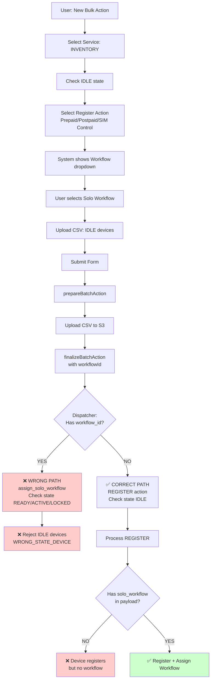

# TTPNEO-1667-INVENTORY-REGISTER-WORKFLOW-BUG

## Bug Overview
Hiện tại đang gặp bug khi thực hiện flow: "New bulk action" → Apply for service: INVENTORY → Apply for: Register Prepaid/Postpaid/SIM Control → Chọn solo workflow

Cần mô tả cụ thể bug gì đang xảy ra (devices không register, workflow không assign, error message, etc.)

---

## Complete Flow Analysis

### Diagram: INVENTORY Register + Workflow Flow



---

## Phase 1: Frontend - BulkAction Component

### File: [BulkAction/index.tsx](file:///home/thang/Documents/rsu/alps-ttp3-frontend/src/components/BulkAction/index.tsx)

### User Flow:
1. Chọn "New bulk action" từ dropdown
2. `bulkActionType = BulkActionType.DEFAULT`
3. Select "Apply for service" = INVENTORY (service_type_id = 6)
4. System loads INVENTORY service states from backend
5. User checks IDLE state
6. User selects "Register" action với target service (Prepaid/Postpaid/SIM Control)
7. System triggers workflow dropdown hiển thị

### Show Workflow Logic - Line ~1150:

```typescript
const isShowWorkflowForRegister = useMemo(() => {
  if (
    canReadWorkflow &&
    bulkActionType === BulkActionType.DEFAULT &&
    selectedService?.service?.label?.toUpperCase() === SERVICE_TYPE.INVENTORY &&
    stateFormValues[0].apply === true &&
    registerServiceType &&
    SERVICE_SUPPORT_SOLO_WORKFLOW.includes(
      SERVICE_NAME_BULK_ACTION[registerServiceType.toUpperCase()]
    )
  ) {
    return true;
  }
  return false;
}, [canReadWorkflow, bulkActionType, selectedService, stateFormValues, registerServiceType]);
```

**Key Variables**:
- `selectedServiceName`: Target service name từ Register action (prepaid, postpaid, simcontrol)
- `registerServiceType`: Converted để fetch workflows
- `selectedWorkflow`: Object chứa `{_id, name, service_type_id}`

### Workflow Dropdown Logic - Line ~1100:

```typescript
const workflowOptions = useMemo(() => {
  if (!workflowListData?.listWorkflows?.items?.length) {
    return [];
  }
  
  return workflowListData.listWorkflows.items
    .filter(workflow => 
      !EXCLUDED_WORKFLOW_KEYWORDS.some(keyword => 
        workflow.name?.toLowerCase().includes(keyword)
      )
    )
    .map(workflow => ({
      label: workflow.name,
      value: workflow._id,
    }));
}, [workflowListData]);
```

---

## Phase 2: Frontend - formatPrepareAction

### File: [BulkAction/index.tsx](file:///home/thang/Documents/rsu/alps-ttp3-frontend/src/components/BulkAction/index.tsx#L551)

### Code Logic - Line 551-667:

```typescript
const formatPrepareAction = () => {
  const newState = [] as BatchActionStates[];
  const values = form.getFieldsValue();
  
  values.states.forEach((state: ActionStateType, index: number) => {
    if (state.apply) {
      const currentState = selectedService?.states[index];
      let currentAction = currentState.actions.find(
        (action) => action?.id === state.action
      );
      
      const applyService = {} as any;
      
      // For INVENTORY service with Register action
      if (SERVICE_TYPE_ID.INVENTORY.toString() === values.service) {
        applyService['apply_service_type_ids'] = [
          REGISTER_SERVICE_TYPE_ID[currentAction.name]
        ];
        // Example: "Register - Prepaid" → apply_service_type_ids: [2]
      }
      
      newState.push({
        action_id: currentAction?.id,
        state_id: currentState.state?.id,  // IDLE state_id = 1
        options: {
          activity_days: state.activationDays ? Number(state.activationDays) : null,
          template_id: currentMessage?.templateId || null,
          ...applyService,
        },
      });
    }
  });
  
  return {
    service_type_id: values.service,  // INVENTORY = 6
    states: newState,
  };
};
```

**Output Example**:
```json
{
  "service_type_id": 6,
  "states": [{
    "action_id": "uuid-register-action",
    "state_id": 1,
    "options": {
      "activity_days": null,
      "template_id": null,
      "apply_service_type_ids": [2]
    }
  }]
}
```

---

## Phase 3: Frontend - handleSubmit

### File: [BulkAction/index.tsx](file:///home/thang/Documents/rsu/alps-ttp3-frontend/src/components/BulkAction/index.tsx#L700)

### Code Logic - Line 700-800:

```typescript
const handleSubmit = async () => {
  await form.validateFields();
  const data = formatPrepareAction();
  
  const csvData = await parseCsvFile(currentFile);
  const rowCountValid = csvData.data.filter(row => row.some(v => v)).length;
  
  setSubmittingFinalize(true);
  const values = form.getFieldsValue();
  
  // Step 1: Prepare batch action
  const res = await prepareAction({
    rowCount: rowCountValid,
    config: data,
    deviceType: DEVICE_TYPE_PARAMS[DeviceTypes.SMARTPHONE],
    brandId: isDeviceSmartphone ? null : values.brand,
    provisionType: isDeviceSmartphone ? null : ProvisioningType.KNOX_GUARD_TAB,
  });
  
  // Step 2: Upload CSV to S3
  if (res?.prepareBatchAction?.fileUpload && currentFile) {
    await uploadFileWithPresignS3(
      res.prepareBatchAction.fileUpload, 
      currentFile
    );
    
    // Step 3: Finalize with workflow info
    await finalizeAction({
      batchActionId: res.prepareBatchAction.batchActionId,
      batchUploadType: BatchUploadTypes.ASSIGN_ACTION,
      billingDetail: {
        billingStartDate: dateFormatterToUTCDateTime(values?.contractStartDate),
        billingCycleId: values?.assignContractId && selectedContract.id,
      },
      simControlId: values?.assignSimControlPolicyId && selectSimPolicy?.simControlId,
      simControlName: values?.assignSimControlPolicyId && selectSimPolicy?.simControlName,
      workflowId: selectedWorkflow._id,  // ✅ Workflow ID passed here
      serviceTypeId: selectedWorkflow.service_type_id,  // Target service (Prepaid)
    });
  }
};
```

**Important Notes**:
- `workflowId` và `serviceTypeId` chỉ được gửi trong `finalizeBatchAction`, KHÔNG có trong `prepareBatchAction`
- `serviceTypeId` là target service (Prepaid=2), NOT INVENTORY (6)

---

## Phase 4: Backend - action_resolver

### File: [action_resolver/src/main.py](file:///home/thang/Documents/rsu/alps-ttp3-backend/modules/action_resolver/src/main.py)

### prepare_batch_action() Logic:

```python
def prepare_batch_action(**kwargs):
    config = kwargs.get("config")
    row_count = kwargs.get("row_count")
    device_type = kwargs.get("device_type")
    brand_id = kwargs.get("brand_id")
    provision_type = kwargs.get("provision_type")
    
    # Build ext_fields
    ext_fields = {
        **config,  # Contains service_type_id & states
        "total_devices": row_count,
        "device_type": device_type,
        "brand_id": brand_id,
        "provision_type": provision_type,
    }
    
    # Insert to t_batch_action
    batch_action_id = conn.insert_batch_action(
        schema_name=schema.name,
        tenant_id=tenant_id,
        created_by=user.id,
        upload_channel="PORTAL",
        ext_fields=json.dumps(ext_fields),
    )
    
    # Generate S3 presigned URL
    presigned_data = generate_presigned_post(
        bucket_name=BATCH_ACTION_BUCKET,
        object_key=f"{tenant_id}/{batch_action_id}.csv",
    )
    
    return {
        "batchActionId": batch_action_id,
        "fileUpload": {
            "url": presigned_data["url"],
            "fields": presigned_data["fields"],
        }
    }
```

**Database State After prepare_batch_action**:
```sql
-- t_batch_action table
id: 1234
tenant_id: "deveco"
created_by: user_id
upload_channel: "PORTAL"
ext_fields: {
  "service_type_id": 6,
  "states": [{
    "action_id": "uuid",
    "state_id": 1,
    "options": {"apply_service_type_ids": [2]}
  }],
  "total_devices": 5,
  "device_type": 1
}
```

### finalize_batch_action() Logic:

```python
def finalize_batch_action(**kwargs):
    batch_action_id = kwargs.get("batch_action_id")
    batch_upload_type = kwargs.get("batch_upload_type")  # "ASSIGN_ACTION"
    workflow_id = kwargs.get("workflow_id")
    service_type_id = kwargs.get("service_type_id")  # Target service (2)
    billing_detail = kwargs.get("billing_detail")
    sim_control_id = kwargs.get("sim_control_id")
    sim_control_name = kwargs.get("sim_control_name")
    
    # Read from database
    batch_action = conn.get_batch_action(schema_name, batch_action_id)
    ext_fields = json.loads(batch_action.ext_fields)
    states = ext_fields.get("states", [])
    
    # ⚠️ CRITICAL LOGIC
    if workflow_id:
        # Update ext_fields with workflow info
        ext_fields["workflow_id"] = workflow_id
        ext_fields["service_type_id"] = service_type_id  # Overwrite INVENTORY with Prepaid
        
        conn.update_batch_action(
            schema_name,
            batch_action_id,
            ext_fields=json.dumps(ext_fields)
        )
    
    # Build message for dispatcher
    message = {
        "batch_action_id": batch_action_id,
        "batch_upload_type": batch_upload_type,
        "states": states,
        "billing_detail": billing_detail,
        "sim_control": {
            "sim_control_id": sim_control_id,
            "sim_control_name": sim_control_name,
        },
        "workflow_id": workflow_id,  # ✅ Passed to dispatcher
        "user_id": user.id,
        "tenant_id": tenant_id,
    }
    
    # Send to BATCH_ACTION_DISPATCHER_SQS
    send_message_to_sqs(
        queue_url=BATCH_ACTION_DISPATCHER_SQS,
        message_body=json.dumps(message),
    )
    
    return {"success": True}
```

**Database State After finalize_batch_action**:
```sql
-- t_batch_action.ext_fields NOW contains:
{
  "service_type_id": 2,  // ⚠️ CHANGED from 6 to 2
  "workflow_id": "68a5ae7a4cb9e87b88b7d344",  // ✅ Added
  "states": [...],
  "total_devices": 5,
  "device_type": 1
}
```

---

## Phase 5: Backend - batch_action_dispatcher

### File: [batch_action_dispatcher/src/main.py](file:///home/thang/Documents/rsu/alps-ttp3-backend/modules/batch_action_dispatcher/src/main.py)

### ❌ CURRENT BUG LOCATION:

```python
def batch_action_upload(**kwargs):
    batch_action_id = kwargs.get("batch_action_id")
    workflow_id = kwargs.get("workflow_id")  # ✅ Received from resolver
    states = kwargs.get("states")
    billing_detail = kwargs.get("billing_detail")
    sim_control = kwargs.get("sim_control")
    
    # Read from database
    batch_action = db.get_batch_action(schema_name, batch_action_id)
    ext_fields = batch_action.ext_fields
    service_type_id = ext_fields.get("service_type_id")  # Now = 2 (Prepaid)
    
    # ❌ BUG: Logic branches incorrectly
    if workflow_id:
        # TAKES THIS PATH (WRONG for REGISTER + workflow scenario)
        logger.info(f"Processing workflow assignment for workflow_id: {workflow_id}")
        
        action_id = "assign_solo_workflow"  # Constant, not from database
        
        # Validate device constraints for DIRECT workflow assignment
        allowed_states = [
            State.READY_FOR_USE,  # 2
            State.ACTIVE,         # 4
            State.LOCKED          # 5
        ]
        allowed_service_types = [
            ServiceType.SIM_CONTROL,  # 1
            ServiceType.PREPAID,      # 2
            ServiceType.POSTPAID      # 3
        ]
        
        # Query devices (no state filter in query, checked later)
        devices = db.get_devices_by_imeis(
            schema_name, 
            device_uids['query'],
            True,
            service_type_id=None  # Don't filter by service
        )
        
        for device in devices:
            # ❌ REJECT IDLE devices
            if device.state_id not in allowed_states:
                # Error: WRONG_STATE_DEVICE
                # This rejects IDLE devices!
                ext_fields, result = data_failure_device(
                    device.imei,
                    Error.WRONG_STATE_DEVICE,
                    device_type,
                    counter_id
                )
                db.insert_batch_action_device(...)
                continue
            
            # ❌ REJECT non-supported service types
            if device.service_type_id not in allowed_service_types:
                # Error: INVALID_SERVICE_TYPE
                ext_fields, result = data_failure_device(
                    device.imei,
                    Error.INVALID_SERVICE_TYPE,
                    device_type,
                    counter_id
                )
                db.insert_batch_action_device(...)
                continue
            
            # Build payload for direct workflow assignment
            payload = {
                "device_uid": device.imei,
                "action_id": action_id,  # "assign_solo_workflow"
                "user_id": user_id,
                "tenant_id": tenant_id,
                "batch_action_id": batch_action_id,
                "batch_upload_type": batch_upload_type,
                "billing_detail": billing_detail,
                "sim_control": sim_control,
                "workflow_id": workflow_id,
                "solo_workflow": {
                    "workflow_id": workflow_id
                },
            }
            
            # Send to processor
            send_to_processor(payload)
    
    else:
        # SHOULD TAKE THIS PATH for REGISTER + workflow
        # But workflow_id exists, so never reaches here!
        
        for state in states:
            action_id = state["action_id"]  # REGISTER action UUID
            state_id = state["state_id"]    # IDLE = 1
            options = state["options"]
            
            # Query devices by state
            devices = db.get_devices_by_state(
                schema_name,
                device_uids,
                state_id=state_id,  # Filter IDLE devices
                service_type_id=service_type_id
            )
            
            for device in devices:
                payload = {
                    "device_uid": device.imei,
                    "action_id": action_id,  # REGISTER UUID
                    "billing_detail": billing_detail,
                    "sim_control": sim_control,
                    "apply_service_type_ids": options.get("apply_service_type_ids"),
                    # ⚠️ MISSING: solo_workflow or pending_workflow_id
                }
                
                send_to_processor(payload)
```

---

## Root Cause Summary

### Bug 1: Wrong Dispatcher Path
**Location**: batch_action_dispatcher/src/main.py

**Problem**:
```python
if workflow_id:
    # ❌ Takes WORKFLOW_ACTION path
    # Expects devices in READY_FOR_USE/ACTIVE/LOCKED
    # Rejects IDLE devices with WRONG_STATE_DEVICE error
```

**Impact**:
- All IDLE devices rejected
- No devices processed
- Batch action fails completely

---

### Bug 2: Missing Workflow in Normal Path
**Location**: batch_action_dispatcher/src/main.py

**Problem**:
Even if we force normal path, payload doesn't include workflow:
```python
payload = {
    "action_id": register_action_id,
    "apply_service_type_ids": [2],
    # ❌ MISSING: solo_workflow or pending_workflow_id
}
```

**Impact**:
- Devices register successfully (IDLE → READY_FOR_USE)
- But workflow NOT assigned
- Silent failure - no error message

---

### Bug 3: Service Type Confusion
**Location**: action_resolver finalize_batch_action

**Problem**:
```python
if workflow_id:
    ext_fields["service_type_id"] = service_type_id  # Changes from 6 to 2
```

**Impact**:
- Loses original INVENTORY service info
- Could affect device filtering logic

---

## Solution: Fix Dispatcher Logic

### File: batch_action_dispatcher/src/main.py

### Approach 1: Detect REGISTER + Workflow Scenario

```python
def batch_action_upload(**kwargs):
    workflow_id = kwargs.get("workflow_id")
    states = kwargs.get("states")
    
    # ✅ NEW: Detect REGISTER + workflow scenario
    is_register_with_workflow = (
        workflow_id and 
        states and 
        len(states) > 0 and
        states[0].get("state_id") == State.IDLE
    )
    
    if is_register_with_workflow:
        # ✅ Use REGISTER path with workflow
        logger.info("Processing REGISTER action with workflow assignment")
        
        for state in states:
            action_id = state["action_id"]  # REGISTER UUID from DB
            state_id = state["state_id"]    # IDLE
            options = state["options"]
            
            # Query IDLE devices
            devices = db.get_devices_by_state(
                schema_name,
                device_uids,
                state_id=state_id,
                service_type_id=None  # Don't filter by service yet
            )
            
            for device in devices:
                # Validate device is INVENTORY or target service
                valid_service_types = [
                    ServiceType.INVENTORY,
                    *options.get("apply_service_type_ids", [])
                ]
                
                if device.service_type_id not in valid_service_types:
                    # Reject device
                    continue
                
                payload = {
                    "device_uid": device.imei,
                    "action_id": action_id,  # REGISTER action
                    "billing_detail": billing_detail,
                    "sim_control": sim_control,
                    "apply_service_type_ids": options.get("apply_service_type_ids"),
                    # ✅ ADD: Workflow info as pending_workflow_id
                    "pending_workflow_id": workflow_id,
                }
                
                send_to_processor(payload)
    
    elif workflow_id:
        # Direct workflow assignment (existing logic for WORKFLOW_ACTION)
        action_id = "assign_solo_workflow"
        allowed_states = [State.READY_FOR_USE, State.ACTIVE, State.LOCKED]
        # ... existing logic
    
    else:
        # Normal action processing (no workflow)
        # ... existing logic
```

---

### Approach 2: Use solo_workflow Format

```python
# In REGISTER + workflow path
payload = {
    "action_id": action_id,
    "billing_detail": billing_detail,
    "apply_service_type_ids": options.get("apply_service_type_ids"),
    # ✅ Option A: Use solo_workflow object
    "solo_workflow": {
        "workflow_id": workflow_id
    },
}
```

---

### Approach 3: Separate Operations

Keep REGISTER and workflow assignment as 2 separate batch operations:
1. First pass: Execute REGISTER (IDLE → READY_FOR_USE)
2. Second pass: Execute workflow assignment (READY_FOR_USE → workflow assigned)

**Pros**: Clean separation, reuses existing logic
**Cons**: Requires 2 API calls, more complex frontend logic

---

## Testing Plan

### Test Case 1: Basic Flow
**Setup**:
- Service: INVENTORY
- Action: Register - Prepaid
- Workflow: "Prepaid Onboarding" (service_type_id = 2)
- CSV: 5 devices, all IDLE, all INVENTORY service

**Expected Result**:
```
✅ All 5 devices: IDLE → READY_FOR_USE
✅ All 5 devices: INVENTORY → PREPAID service
✅ All 5 devices: Workflow assigned
✅ Action History: 5 success, 0 failed
```

**Verification SQL**:
```sql
SELECT uid, state_id, service_type_id, is_activating_workflow
FROM t_device
WHERE uid IN ('IMEI1', 'IMEI2', 'IMEI3', 'IMEI4', 'IMEI5');

-- Expected:
-- state_id = 2 (READY_FOR_USE)
-- service_type_id = 2 (PREPAID)
-- is_activating_workflow = true
```

---

### Test Case 2: Mixed Device States
**Setup**:
- CSV contains: 3 IDLE devices + 2 READY_FOR_USE devices

**Expected Result**:
```
✅ 3 IDLE devices: Process successfully
❌ 2 READY_FOR_USE devices: Reject with WRONG_STATE_DEVICE
✅ Action History: 3 success, 2 failed
```

---

### Test Case 3: Service Type Mismatch
**Setup**:
- Action: Register - Prepaid
- CSV contains: 3 INVENTORY devices + 2 POSTPAID devices

**Expected Result**:
```
✅ 3 INVENTORY devices: Process successfully
✅ 2 POSTPAID devices: Process successfully (change service)
OR
❌ 2 POSTPAID devices: Reject (depending on requirements)
```

---

### Test Case 4: All Service Types
**Test 4a**: INVENTORY → Register SIM Control + Workflow
**Test 4b**: INVENTORY → Register Postpaid + Workflow
**Test 4c**: INVENTORY → Register Prepaid + Workflow

All should work with appropriate workflows.

---

## Related Documents

### Reference Files
1. [TPDEVCO-1362.md](file:///home/thang/Documents/rsu/copilot-rules/TPDEVCO-1362.md)
   - Bulk Workflow Assignment implementation
   - Similar flow for WORKFLOW_ACTION type

2. [BATCH-UPLOAD-ASSIGN-WORKFLOW-FLOW.md](file:///home/thang/Documents/rsu/copilot-rules/BATCH-UPLOAD-ASSIGN-WORKFLOW-FLOW.md)
   - Complete 6-phase flow diagram
   - Flow A: Direct Assignment (R4U/ACTIVE/LOCKED)
   - Flow B: Pending Assignment (IDLE + REGISTER)

### Code Files
1. Frontend:
   - [BulkAction/index.tsx](file:///home/thang/Documents/rsu/alps-ttp3-frontend/src/components/BulkAction/index.tsx)

2. Backend:
   - [action_resolver/src/main.py](file:///home/thang/Documents/rsu/alps-ttp3-backend/modules/action_resolver/src/main.py)
   - [batch_action_dispatcher/src/main.py](file:///home/thang/Documents/rsu/alps-ttp3-backend/modules/batch_action_dispatcher/src/main.py)
   - [batch_action_processor/src/devices/device.py](file:///home/thang/Documents/rsu/alps-ttp3-backend/modules/batch_action_processor/src/devices/device.py)
   - [action_trigger/src/handlers/message_handler.py](file:///home/thang/Documents/rsu/alps-ttp3-backend/modules/action_trigger/src/handlers/message_handler.py)

---

## Next Steps

1. **Xác định bug cụ thể**: Devices bị reject? Workflow không assign? Error message nào?
2. **Chọn solution approach**: Pending_workflow_id hoặc solo_workflow?
3. **Implement fix trong dispatcher**: Thêm logic detect REGISTER + workflow scenario
4. **Test thoroughly**: All 3 service types (Prepaid/Postpaid/SIM Control)
5. **Verify milestone history**: Đảm bảo history tab shows correct info
