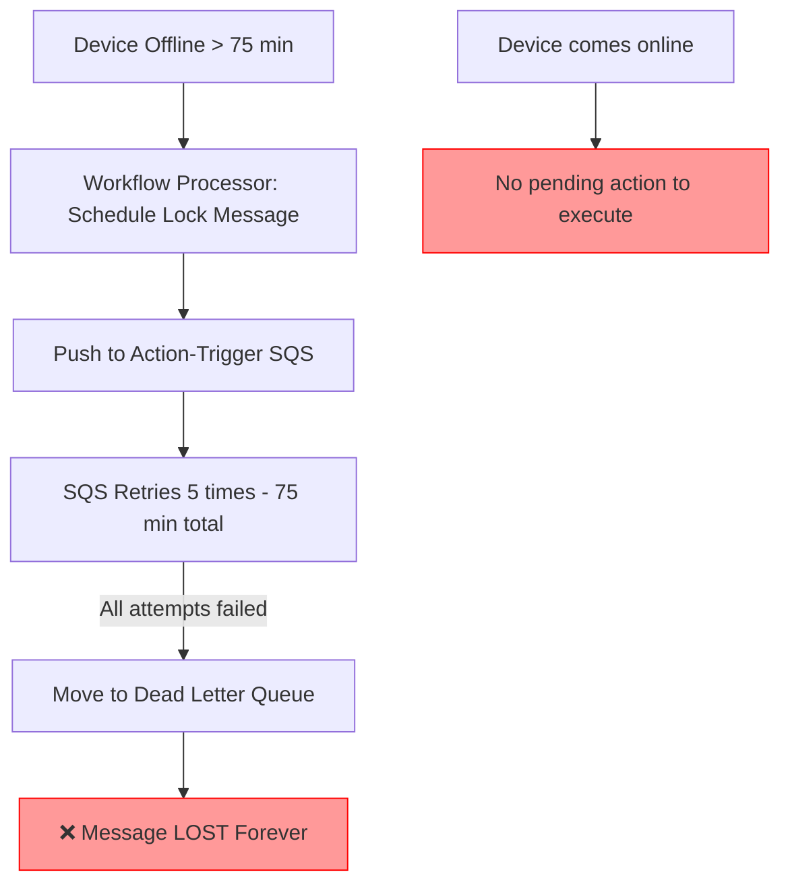

# [3.0.10.1][Workflow] Lock Message not Triggered for Offline Devices

## Issue Description

Device được assign workflow và đang offline, khi thời gian lock message đến thì action không được trigger và không xuất hiện trong next check-in pending actions panel.

### Expected Behavior
Lock message phải được trigger và hiển thị trong pending action queue để execute khi device check-in lần tiếp theo.

### Actual Behavior  
Lock message không được trigger và không xuất hiện trong next check-in panel khi device offline.

---

## IMPORTANT DISCOVERY: System Already Handles This!

After careful analysis, **THE SYSTEM ALREADY HAS MECHANISM TO HANDLE OFFLINE DEVICES**:

### How It Works Currently

1. **Workflow Processor** pushes action to SQS at scheduled time (không care device online/offline)
2. **Action-Trigger** receives message từ SQS và tries to execute
3. **If device offline/unreachable:**
   - SQS automatically retries với visibility timeout (900s = 15 minutes)
   - After `maxReceiveCount: 5` retries → message goes to Dead Letter Queue
4. **Dead Letter Queue** keeps failed messages for up to 14 days (1209600s)

### SQS Configuration
[serverless/resources.yml](file:///home/thang/Documents/rsu/alps-ttp3-backend/serverless/resources.yml#L214)

```yaml
ActionTriggerQueue:
  Type: AWS::SQS::Queue
  Properties:
    QueueName: alps-${param:env_name}-ttp3-action-trigger-sqs
    RedrivePolicy:
      deadLetterTargetArn:
        Fn::GetAtt:
          - ActionTriggerDeadLetterQueue
          - Arn
      maxReceiveCount: 5          # Retry 5 times
    VisibilityTimeout: 900        # 15 minutes between retries

ActionTriggerDeadLetterQueue:
  Type: AWS::SQS::Queue
  Properties:
    QueueName: alps-${param:env_name}-ttp3-action-trigger-dl-queue
    MessageRetentionPeriod: 1209600  # Keep for 14 days
```

### Retry Timeline

```
Device Offline → Action pushed to SQS
  ↓
Attempt 1: Fails → Retry after 15 min
  ↓
Attempt 2: Fails → Retry after 15 min
  ↓
Attempt 3: Fails → Retry after 15 min
  ↓
Attempt 4: Fails → Retry after 15 min
  ↓
Attempt 5: Fails → Move to DLQ (stored for 14 days)
```

Total retry time: ~75 minutes (5 attempts × 15 minutes)

---

## Root Cause Analysis (UPDATED)

### The REAL Problem

System ĐÃ CÓ retry mechanism qua SQS, NHƯNG:

1. **SQS retry chỉ tốt cho short-term offline** (~75 minutes)
2. **Device offline > 75 minutes** → message vào DLQ và **KHÔNG BAO GIỜ ĐƯỢC RETRY LẠI**
3. **DLQ messages KHÔNG được auto-reprocess** khi device online trở lại
4. **Không có monitoring/alert** khi messages vào DLQ

### Problem Flow



### Evidence from Code

#### Action Trigger Error Handling
[message_handler.py#L800-820](file:///home/thang/Documents/rsu/alps-ttp3-backend/modules/action_trigger/src/handlers/message_handler.py#L800)

```python
else:
    # Update workflow step instance state to failed
    if payload_dto.device_workflow_step_id:
        workflow_handler.update_workflow_step_instance_state(
            device_uid=payload_dto.device_uid,
            device_workflow_step_id=payload_dto.device_workflow_step_id,
            state=WorkflowStepInstanceState.IS_FAILED,
        )
    
    milestone_handler.reject_assigned_action_history(
        schema=schema, user_id=payload_dto.user_id, device=device, action=action,
        assigned_action_history_id=assigned_action_history_id, 
        enabled_mark_milestone=enabled_mark_milestone, 
        milestone_ext_fields=milestone_ext_fields
    )
```

**Problem**: Khi action fails, workflow step instance được mark là `IS_FAILED` nhưng **KHÔNG ADD VÀO PENDING QUEUE**

**Problem**: Khi action fails, workflow step instance được mark là `IS_FAILED` nhưng **KHÔNG ADD VÀO PENDING QUEUE**

---

## Solution Design (UPDATED)

### Option 1: Add Failed Actions to Pending Queue (RECOMMENDED)

Khi workflow action fails sau tất cả SQS retries, thay vì để message vào DLQ, add vào pending queue để execute khi device check-in.

#### Implementation

**File**: [message_handler.py](file:///home/thang/Documents/rsu/alps-ttp3-backend/modules/action_trigger/src/handlers/message_handler.py#L800)

```python
else:
    # Action execution failed
    if payload_dto.device_workflow_step_id:
        workflow_handler.update_workflow_step_instance_state(
            device_uid=payload_dto.device_uid,
            device_workflow_step_id=payload_dto.device_workflow_step_id,
            state=WorkflowStepInstanceState.IS_FAILED,
        )
    
    milestone_handler.reject_assigned_action_history(
        schema=schema, user_id=payload_dto.user_id, device=device, action=action,
        assigned_action_history_id=assigned_action_history_id, 
        enabled_mark_milestone=enabled_mark_milestone, 
        milestone_ext_fields=milestone_ext_fields
    )
    
    # ✅ NEW: Add failed workflow action to pending queue
    if payload_dto.device_workflow_step_id:
        logger.info(f"Adding failed workflow action to pending queue for device {payload_dto.device_uid}")
        
        # Reconstruct action trigger payload for pending queue
        pending_payload = {
            "device_uid": payload_dto.device_uid,
            "tenant_id": payload_dto.tenant_id,
            "action_id": action.id,
            "device_workflow_step_id": payload_dto.device_workflow_step_id,
            "user_id": payload_dto.user_id,
            "workflow": payload_dto.workflow.__dict__ if payload_dto.workflow else None,
            "notification": payload_dto.notification.__dict__ if payload_dto.notification else None,
            "trigger_type": TriggerType.FROM_WORKFLOW,
        }
        
        # Insert into t_queue_action table
        base_dao.insert_pending_action(
            schema_name=schema.name,
            device_id=device.id,
            tenant_id=payload_dto.tenant_id,
            user_id=payload_dto.user_id,
            action_id=action.id,
            action_trigger_payload=pending_payload
        )
        
        logger.info(f"Successfully added workflow action to pending queue")
```

**Advantages**:
- ✅ Reuse existing pending queue infrastructure
- ✅ Action sẽ execute khi device check-in lần tiếp
- ✅ Không lost messages
- ✅ Works for all provision types (DLC/DPC/Samsung)

### Option 2: DLQ Monitoring + Manual Reprocessing

Monitor DLQ và manually reprocess messages khi detect device online.

**Disadvantages**:
- ❌ Cần thêm monitoring system
- ❌ Cần manual intervention
- ❌ Không automatic
- ❌ Phức tạp hơn

### Option 3: Increase SQS Retry Count

Increase `maxReceiveCount` từ 5 lên 50+.

**Disadvantages**:
- ❌ Chỉ delay problem, không solve
- ❌ Device có thể offline > 1 ngày
- ❌ Tốn resources cho endless retries

---

---

## Implementation Plan

### Phase 1: Add Pending Queue Support in Action Trigger

**File**: `action_trigger/src/handlers/message_handler.py`

1. Add helper function để insert pending action:
```python
def add_workflow_action_to_pending_queue(base_dao, schema_name, device, action, payload_dto):
    """Add failed workflow action to pending queue for retry on next check-in"""
    pending_payload = {
        "device_uid": payload_dto.device_uid,
        "tenant_id": payload_dto.tenant_id,
        "action_id": action.id,
        "device_workflow_step_id": payload_dto.device_workflow_step_id,
        "user_id": payload_dto.user_id,
        "workflow": payload_dto.workflow.__dict__ if payload_dto.workflow else None,
        "notification": payload_dto.notification.__dict__ if payload_dto.notification else None,
        "trigger_type": TriggerType.FROM_WORKFLOW,
    }
    
    base_dao.insert_pending_action(
        schema_name=schema_name,
        device_id=device.id,
        tenant_id=payload_dto.tenant_id,
        user_id=payload_dto.user_id,
        action_id=action.id,
        action_trigger_payload=pending_payload
    )
```

2. Call function trong error handling block (line ~810)

### Phase 2: Add DAO Method

**File**: `action_trigger/src/dao.py`

```python
def insert_pending_action(self, schema_name, device_id, tenant_id, user_id, action_id, action_trigger_payload):
    """Insert failed action into pending queue"""
    sql = f"""
        INSERT INTO {schema_name}.t_queue_action 
        (device_id, tenant_id, user_id, action_id, action_trigger_payload, created_at)
        VALUES (%s, %s, %s, %s, %s, NOW())
    """
    self.conn.cursor().execute(sql, (
        device_id, tenant_id, user_id, action_id, 
        json.dumps(action_trigger_payload)
    ))
    self.conn.commit()
```

### Phase 3: Update Workflow Step Instance Status

Thay vì mark `IS_FAILED`, mark là `IS_PENDING` để indicate action đang chờ trong queue:

```python
workflow_handler.update_workflow_step_instance_state(
    device_uid=payload_dto.device_uid,
    device_workflow_step_id=payload_dto.device_workflow_step_id,
    state=WorkflowStepInstanceState.IS_PENDING,  # Changed from IS_FAILED
)
```

### Phase 4: Test

1. Device offline > 75 minutes
2. Lock message scheduled
3. After 5 SQS retries → Check pending queue has action
4. Device check-in → Action executes from pending queue

---

## Testing Plan (UPDATED)

---

## Testing Plan (UPDATED)

### Test Case 1: Short-term Offline (< 75 min) - EXISTING WORKS
**Setup**:
1. Workflow với lock message scheduled
2. Device offline
3. Device online again trong 75 phút

**Expected**:
- ✅ SQS retries tự động
- ✅ Action execute successfully khi device online
- ✅ NO NEED TO FIX - Already working

### Test Case 2: Long-term Offline (> 75 min) - BUG HERE
**Setup**:
1. Workflow với lock message scheduled  
2. Device offline > 75 minutes
3. SQS retries all failed → message to DLQ
4. Device online trở lại

**Current Behavior**:
- ❌ Message lost in DLQ
- ❌ No pending action
- ❌ Lock message never executes

**Expected After Fix**:
- ✅ Failed action added to pending queue
- ✅ Khi device check-in: action executes from queue
- ✅ Lock message appears in pending actions panel

### Test Case 3: Device Never Online
**Setup**:
1. Device offline vĩnh viễn (broken/lost)
2. Lock message scheduled

**Expected**:
- Action stays in pending queue
- Admin can see pending actions
- Can manually clean up if needed

---

## Files to Modify (UPDATED)

### 1. Action Trigger Module

**message_handler.py** [Line ~810](file:///home/thang/Documents/rsu/alps-ttp3-backend/modules/action_trigger/src/handlers/message_handler.py#L810)
- Add call to `add_workflow_action_to_pending_queue()` trong error handling block
- Change workflow step instance state từ `IS_FAILED` → `IS_PENDING`

**dao.py** (hoặc base_dao)
- Add `insert_pending_action()` method

### 2. Checkin Modules (NO CHANGE NEEDED)

Existing pending action handlers đã handle correctly:
- [checkin/handlers.py action_pending_handler](file:///home/thang/Documents/rsu/alps-ttp3-backend/modules/checkin/src/handlers.py#L1593) ✅
- [checkin_dlc_dpc/helpers.py action_pending_handler](file:///home/thang/Documents/rsu/alps-ttp3-backend/modules/checkin_dlc_dpc/src/handlers/helpers.py#L2088) ✅

---

## Summary

### What We Discovered

1. ✅ **System ĐÃ CÓ retry mechanism** qua SQS (5 retries × 15 min = 75 min)
2. ❌ **Bug**: Actions failed sau 75 min vào DLQ và **NEVER RETRY**
3. ❌ **Missing**: No mechanism to add failed workflow actions to pending queue
4. ✅ **Backend đã có** pending queue infrastructure - chỉ cần integrate

### The Fix

**ONE SIMPLE CHANGE**: Khi workflow action fails (sau all SQS retries), add vào pending queue thay vì để lost trong DLQ.

**Impact**: LOW risk, reuse existing infrastructure, solve problem completely.

### Priority

**CRITICAL** - User-facing bug, data loss (lost actions), affects all workflows with offline devices.

**Complexity**: LOW - Just add one function call trong error handling.

**Risk**: LOW - Reuse existing tested pending queue mechanism.

Flow hiện tại:
1. **list_step_action_files_by_date** - Lấy các workflow steps đã schedule cho ngày hôm nay
2. **process_labeling_step_action_file** - Phân loại actions:
   - NEED_TO_EXECUTED: action hợp lệ, chưa execute
   - INVALID: device removed from workflow/contract, hoặc có pending action conflict
   - ALREADY_EXECUTED: đã execute rồi
3. **todo_workflow_step_handler** - Prepare payload cho action cần execute
4. **push_trigger_payload_to_sqs** - Push payload tới SQS

#### Invalid Action Logic
[ws_processor.py#L140](file:///home/thang/Documents/rsu/alps-ttp3-workflow/src/sam/functions/workflow_processor/tasks/ws_processor.py#L140)

Action bị coi là invalid khi:
- Device removed from workflow/contract
- Billing cycle đã paid/deleted
- **Device có pending action conflict** (check_pending_action returns True)

#### Pending Action Check
[ws_processor.py#L193](file:///home/thang/Documents/rsu/alps-ttp3-workflow/src/sam/functions/workflow_processor/tasks/ws_processor.py#L193)

```python
def check_pending_action(device: dict, device_workflow_step_id: str):
    if device.get("assignedActionId") == "-1" or not device.get("assignedActionId"):
        return False
    
    pending_action_data = db.get_platform_action_data(
        action_id=device.get("assignedActionId"), 
        schema_name=device.get("tenantId")
    )
    workflow_current_action_data = db.get_step_action_instance(device_workflow_step_id)
    
    if not pending_action_data or not workflow_current_action_data:
        return False
        
    pending_action_name = pending_action_data.get("actionName")
    
    if pending_action_name == ActionName.UNLOCK:
        return True
    elif pending_action_name in (ActionName.TEMPORARY_LOCK, ActionName.LOCK):
        mapping_current_action_data = db.get_platform_action_data(
            action_id=current_action_id, 
            schema_name=device.get("tenantId")
        )
        if pending_action_name == ActionName.LOCK and \
           mapping_current_action_data.get("actionName") != ActionName.UNLOCK:
            return True
    return False
```

### 3. The Problem

**Khi device offline**:
1. Workflow processor chạy đúng schedule time
2. Action được labeled là NEED_TO_EXECUTED (vì device không có pending action conflict)
3. Payload được prepare trong `todo_workflow_step_handler`
4. Payload được push tới action-trigger SQS

**NHƯNG**:
- Action-trigger module **không kiểm tra device online/offline status** trước khi execute
- Nếu device offline, action sẽ **fail** hoặc **timeout**
- **KHÔNG CÓ MECHANISM** để add failed action vào pending action queue
- Khi device check-in lại, pending action queue **RỖNG** → không có action nào execute

### 4. Missing Pieces

#### 4.1. No Device Status Check Before Trigger
[todo_workflow_step_handler](file:///home/thang/Documents/rsu/alps-ttp3-workflow/src/sam/functions/workflow_processor/tasks/ws_processor.py#L303)

```python
def todo_workflow_step_handler(s3_object_key) -> List[dict]:
    valid_workflow_steps = utils.download_file_from_s3(BUCKET_NAME, s3_object_key)
    trigger_payloads = []
    
    for workflow_step in valid_workflow_steps:
        device_id = workflow_step.get("deviceId")
        # ❌ NO CHECK: Is device online?
        # ❌ NO CHECK: Can device receive command now?
        
        payload = {
            "device_uid": device_id,
            "action_id": workflow_instance.get("actionId"),
            # ... other fields
        }
        trigger_payloads.append(payload)
        push_trigger_payload_to_sqs(payload)  # Always push, không check device status
    
    return trigger_payloads
```

#### 4.2. No Fallback to Pending Queue

Backend modules có pending action mechanism:
- [action_pending_handler (checkin)](file:///home/thang/Documents/rsu/alps-ttp3-backend/modules/checkin/src/handlers.py#L1593)
- [action_pending_handler (checkin_dlc_dpc)](file:///home/thang/Documents/rsu/alps-ttp3-backend/modules/checkin_dlc_dpc/src/handlers/helpers.py#L2088)

**NHƯNG workflow processor KHÔNG SỬ DỤNG mechanism này**

Workflow actions được trigger trực tiếp qua SQS, không qua pending queue:
```python
# Workflow processor pushes directly to action-trigger SQS
push_trigger_payload_to_sqs(payload)

# ❌ MISSING: Add to pending queue if device offline
# Should be like:
if is_device_offline(device_id):
    add_to_pending_queue(device_id, payload)
else:
    push_trigger_payload_to_sqs(payload)
```

---

## Impact

### Affected Scenarios
1. Device offline khi workflow action schedule time đến
2. Device không connected to Wi-Fi khi lock message cần trigger
3. Device bị tắt nguồn hoặc no network khi action cần execute

### Affected Actions
Tất cả workflow actions bị ảnh hưởng:
- Lock message
- Send message  
- Temporary lock
- Notify
- Assign SIM control rule

---

## Solution Design

### Option 1: Add Device Status Check + Pending Queue (Recommended)

**File**: [ws_processor.py](file:///home/thang/Documents/rsu/alps-ttp3-workflow/src/sam/functions/workflow_processor/tasks/ws_processor.py#L303)

```python
def todo_workflow_step_handler(s3_object_key) -> List[dict]:
    valid_workflow_steps = utils.download_file_from_s3(BUCKET_NAME, s3_object_key)
    trigger_payloads = []
    
    for workflow_step in valid_workflow_steps:
        device_id = workflow_step.get("deviceId")
        tenant_id = workflow_step.get("tenantId")
        
        # ✅ NEW: Get device status from backend
        device_status = db.get_device_status(device_id, tenant_id)
        
        payload = {
            "device_uid": device_id,
            "tenant_id": tenant_id,
            "action_id": workflow_instance.get("actionId"),
            "device_workflow_step_id": device_workflow_step_id,
            # ... other fields
        }
        
        # ✅ NEW: Check device status before push
        if device_status.is_online() and device_status.can_receive_action():
            # Device online → execute ngay
            logger.info(f"Device {device_id} is online, pushing to SQS")
            push_trigger_payload_to_sqs(payload)
        else:
            # Device offline → add to pending queue
            logger.info(f"Device {device_id} is offline, adding to pending queue")
            db.add_to_pending_queue(
                device_id=device_id,
                tenant_id=tenant_id, 
                action_trigger_payload=payload,
                schema_name=tenant_id
            )
        
        trigger_payloads.append(payload)
    
    return trigger_payloads
```

**Implementation Steps**:

1. **Add device status check function** trong workflow processor db module
   ```python
   def get_device_status(device_id: str, tenant_id: str) -> dict:
       # Query backend DB to get device online status
       # Return: {is_online, last_checkin_time, can_receive_action}
   ```

2. **Add pending queue function** trong workflow processor db module  
   ```python
   def add_to_pending_queue(device_id, tenant_id, action_trigger_payload, schema_name):
       # Insert into t_queue_action table
       # Similar to backend's pending device handler
   ```

3. **Reuse existing pending action handler** trong checkin modules
   - [checkin/handlers.py action_pending_handler](file:///home/thang/Documents/rsu/alps-ttp3-backend/modules/checkin/src/handlers.py#L1593)
   - [checkin_dlc_dpc/helpers.py action_pending_handler](file:///home/thang/Documents/rsu/alps-ttp3-backend/modules/checkin_dlc_dpc/src/handlers/helpers.py#L2088)
   
   Khi device check-in:
   - Get first pending action from queue
   - Execute action
   - Remove from queue

### Option 2: Retry Mechanism with Exponential Backoff

Thêm retry logic trong action-trigger nếu device offline:

**File**: action-trigger module

```python
async def handle_workflow_action(payload):
    max_retries = 3
    retry_delays = [300, 900, 3600]  # 5min, 15min, 1hour
    
    for attempt in range(max_retries):
        try:
            # Try to execute action
            result = await execute_action(payload)
            if result.success:
                return result
        except DeviceOfflineException:
            if attempt < max_retries - 1:
                delay = retry_delays[attempt]
                logger.warning(f"Device offline, retry in {delay}s")
                await asyncio.sleep(delay)
            else:
                # Max retries reached → add to pending queue
                await add_to_pending_queue(payload)
```

**Disadvantages**:
- Tốn thời gian retry
- Action có thể bị delay nhiều giờ
- Phức tạp hơn Option 1

---

## Testing Plan

### Test Case 1: Device Offline When Action Scheduled
**Setup**:
1. Create workflow với lock message scheduled trong 5 phút
2. Assign workflow to device
3. Turn off device Wi-Fi

**Expected**:
- Lock message được add vào pending queue
- Khi device check-in lại, lock message xuất hiện trong pending actions
- Lock message được execute sau khi check-in

### Test Case 2: Device Online When Action Scheduled  
**Setup**:
1. Create workflow với lock message scheduled trong 5 phút
2. Assign workflow to device
3. Keep device online

**Expected**:
- Lock message được execute ngay khi đến scheduled time
- Không add vào pending queue

### Test Case 3: Device Goes Offline After Action Started
**Setup**:
1. Action đang được execute
2. Device bị disconnect giữa chừng

**Expected**:
- Action được retry hoặc add vào pending queue
- Không bị lost action

---

## Files to Modify

### Workflow Service

1. **ws_processor.py** - Add device status check
   [Link](file:///home/thang/Documents/rsu/alps-ttp3-workflow/src/sam/functions/workflow_processor/tasks/ws_processor.py#L303)
   - `todo_workflow_step_handler()`: Add device status check before push to SQS
   - Add `add_to_pending_queue()` function

2. **db.py** - Add device status query
   - `get_device_status()`: Query device online status from backend DB
   - `add_to_pending_queue()`: Insert into t_queue_action table

### Backend Service (Already Implemented)

3. **checkin/handlers.py** - Already has pending action handler
   [Link](file:///home/thang/Documents/rsu/alps-ttp3-backend/modules/checkin/src/handlers.py#L1593)
   - No changes needed

4. **checkin_dlc_dpc/helpers.py** - Already has pending action handler  
   [Link](file:///home/thang/Documents/rsu/alps-ttp3-backend/modules/checkin_dlc_dpc/src/handlers/helpers.py#L2088)
   - No changes needed

---

## Related Code References

### Workflow Processor
- [process_labeling_step_action_file](file:///home/thang/Documents/rsu/alps-ttp3-workflow/src/sam/functions/workflow_processor/tasks/ws_processor.py#L73)
- [is_step_action_invalid](file:///home/thang/Documents/rsu/alps-ttp3-workflow/src/sam/functions/workflow_processor/tasks/ws_processor.py#L140)  
- [check_pending_action](file:///home/thang/Documents/rsu/alps-ttp3-workflow/src/sam/functions/workflow_processor/tasks/ws_processor.py#L193)
- [todo_workflow_step_handler](file:///home/thang/Documents/rsu/alps-ttp3-workflow/src/sam/functions/workflow_processor/tasks/ws_processor.py#L303)
- [push_trigger_payload_to_sqs](file:///home/thang/Documents/rsu/alps-ttp3-workflow/src/sam/functions/workflow_processor/tasks/ws_processor.py#L370)

### Backend Pending Action Handlers
- [checkin action_pending_handler](file:///home/thang/Documents/rsu/alps-ttp3-backend/modules/checkin/src/handlers.py#L1593)
- [checkin_dlc_dpc action_pending_handler](file:///home/thang/Documents/rsu/alps-ttp3-backend/modules/checkin_dlc_dpc/src/handlers/helpers.py#L2088)

### Action Types & Models
- [ActionType enum](file:///home/thang/Documents/rsu/alps-ttp3-workflow/src/sam/functions/workflow_processor/models.py#L61)
- [ActionName class](file:///home/thang/Documents/rsu/alps-ttp3-workflow/src/sam/functions/workflow_processor/models.py#L72)
- [ProvisionType](file:///home/thang/Documents/rsu/alps-ttp3-workflow/src/sam/functions/workflow_processor/models.py#L81)

---

## Implementation Priority

**Priority**: HIGH - Critical user-facing bug

**Complexity**: MEDIUM
- Cần modify workflow processor logic
- Cần add DB queries for device status
- Reuse existing pending action infrastructure

**Risk**: LOW  
- Backend pending action handlers đã stable
- Chỉ thêm logic check trước khi push to SQS
- Không impact existing flows

**Recommendation**: Implement Option 1 với device status check + pending queue mechanism
